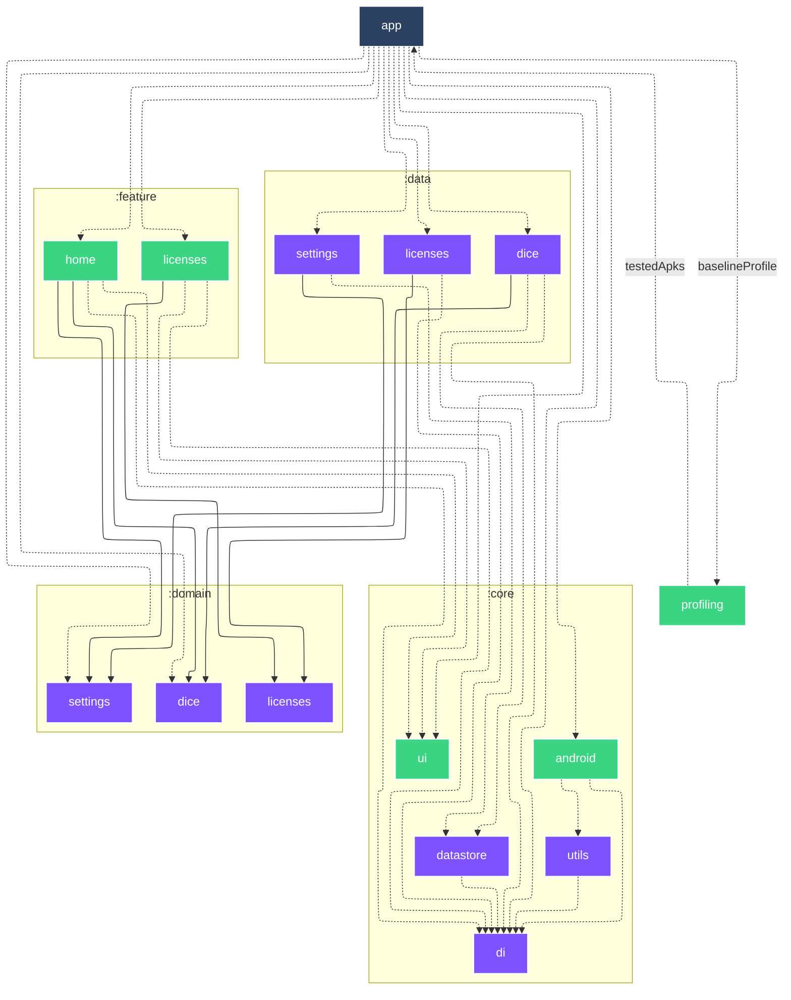

# 🛝 Android Playground

|                                                                                🌑                                                                                |                                                                                 ☀️                                                                                  |
|:----------------------------------------------------------------------------------------------------------------------------------------------------------------:|:-------------------------------------------------------------------------------------------------------------------------------------------------------------------:|
|                                                                                      |                                                                                      |
| 

📜 Open Source licenses…

 | 

📜 Open Source licenses…

 |

#### 🐘 Gradle

| Task                                                             | Description                                                                                 |
|------------------------------------------------------------------|---------------------------------------------------------------------------------------------|
| `gradlew assembleDebug`                                          | Build debug APK                                                                             |
| `gradlew assembleRelease`                                        | Build release APK (optimized & minified)                                                    |
| `gradlew apiCheck`                                               | Checks project public API ([BCV](https://github.com/Kotlin/binary-compatibility-validator)) |
| `gradlew apiDump`                                                | Dumps project public API ([BCV](https://github.com/Kotlin/binary-compatibility-validator))  |
| `gradlew licensee`                                               | Runs [Licensee](https://github.com/cashapp/licensee) dependency license validation          |
| `gradlew topologyCheck`                                          | Checks the topology of project dependencies                                                 |
| `gradlew dependencyLockState --write-locks`                      | Updates dependency lock state                                                               |
| `gradlew ciBadging -Pplayground.isMinifyEnabled=false`           | CI badging checks                                                                           |
| `gradlew globalCiLint`                                           | CI Lint checks (html/sarif/txt/xml)                                                         |
| `gradlew globalCiUnitTest`                                       | CI unit tests (html/xml)                                                                    |
| `gradlew verifyScreenshots`                                      | Verify screenshot tests images against golden images                                        |
| `gradlew recordScreenshots`                                      | Record screenshot tests golden images                                                       |
| `gradlew cleanRecordScreenshots`                                 | Clean and record screenshot tests golden images                                             |
| `gradlew generateBaselineProfile`                                | Generates Baseline & Startup profiles                                                       |
| `gradlew connectedBenchmarkAndroidTest`                          | Runs benchmark tests                                                                        |
| `gradlew assembleRelease -Pplayground.compose.compilerMetrics`   | Compose compiler metrics                                                                    |
| `gradlew assembleRelease -Pplayground.compose.compilerReports`   | Compose compiler reports                                                                    |
| `gradlew --write-verification-metadata pgp,sha256 --export-keys` | Generates verification metadata & keyring                                                   |
| `gradlew graphDump`                                              | Dumps project dependencies to a mermaid file                                                |
| `gradlew graphUpdate`                                            | Updates Markdown file with the corresponding dependency graph                               |

#### 🐙 GitHub workflows

- 
- 
- 
- 
- 
- 
- 
- 
- 
- 
- 

#### 🐙 GitHub composite actions

- [`📦 Archive Gradle reports`](.github/actions/archive-gradle-reports/action.yaml)
- [`📦 Archive JUnit reports`](.github/actions/archive-junit-reports/action.yaml)
- [`📦 Archive Lint reports`](.github/actions/archive-lint-reports/action.yaml)
- [`📦 Archive Paparazzi reports`](.github/actions/archive-paparazzi-reports/action.yaml)
- [`👮 Check git-lfs files`](.github/actions/check-git-lfs/action.yaml)
- [`🐘 Check Gradle dependency lock state`](.github/actions/check-gradle-dependency-lock-state/action.yaml)
- [`🤖 Setup Bot`](.github/actions/setup-bot/action.yaml)
- [`🐘 Setup Gradle`](.github/actions/setup-gradle/action.yaml)
- [`🐘 Setup gradle.properties`](.github/actions/setup-gradle-properties/action.yaml)
- [`☕️ Setup Java`](.github/actions/setup-java/action.yaml)

#### 🕵️ Lint checks

- 

<a href="https://github.com/SimonMarquis/Android-Playground/blob/main/lint/src/main/kotlin/fr/smarquis/playground/lint/AssertionsDetector.kt">AssertionsDetector</a>

  - Prefer using `kotlin.test` assertions instead of JUnit's in Kotlin unit tests.
  - Prefer using `kotlin.test` assertions instead of `assert` in unit tests. Its execution requires a specific JVM option to be enabled on the JVM.
  - Prefer using `assertIs` and `assertIsNot` assertions when checking for types instead of boolean assertions.
  - Prefer using `assertEquals`/`assertSame` and `assertNotEquals`/`assertNotSame` assertions when checking for equality instead of boolean assertions.

- 

<a href="https://github.com/SimonMarquis/Android-Playground/blob/main/lint/src/main/kotlin/fr/smarquis/playground/lint/GradleVersionCatalogDetector.kt">GradleVersionCatalogDetector</a>

  - Dependencies should be sorted alphabetically to maintain consistency and readability.
  - Dependencies should follow the configured regex.
  - Extracting a version in the `[versions]` section is useful only if it is used more than once or referenced elsewhere.
  - Dependency declaration should use the simplest form possible, omitting unnecessary inline tables.

- 

<a href="https://github.com/SimonMarquis/Android-Playground/blob/main/lint/src/main/kotlin/fr/smarquis/playground/lint/NamedParametersDetector.kt">NamedParametersDetector</a>

  - Not specifying parameters name using the same type can lead to unexpected results when refactoring methods signature.  
    Enforcing explicit named parameters also helps detecting mistakes during code review.  
    Quick fix: `⌥⏎` (macOS) or `Alt+Enter` (Windows/Linux) ➝ `Add names to call arguments`.
  - Using a variable for a function call parameter while another parameter with the exact same name exists is probably a bug.

- 

<a href="https://github.com/SimonMarquis/Android-Playground/blob/main/lint/src/main/kotlin/fr/smarquis/playground/lint/ReplaceMethodCallDetector.kt">ReplaceMethodCallDetector</a>

  - The method `foo()` should not be called!

- 

<a href="https://github.com/SimonMarquis/Android-Playground/blob/main/lint/src/main/kotlin/fr/smarquis/playground/lint/TestMethodBannedWordsDetector.kt">TestMethodBannedWordsDetector</a>

  - Test methods name should not contains banned words.
    The default behavior checks for `failure,failed` words to reduce collisions when searching through logs.

- 

<a href="https://github.com/SimonMarquis/Android-Playground/blob/main/lint/src/main/kotlin/fr/smarquis/playground/lint/TypographyDetector.kt">TypographyDetector</a>

  - Escaped character are impossible to decipher for a human. Using unescaped character is generally self explanatory.
  - Typography can be replaced with a better alternative.
  - Curly quotes must be replaced with straight quote as Talkback does not properly handle them.

#### 🏗️ Architecture

<!--region graph-->
> [!TIP]
> [✨ View in `mermaid.live`](https://mermaid.live/view#base64:eyJjb2RlIjoiLS0tXG5jb25maWc6XG4gIGxheW91dDogZWxrXG4gIGVsazpcbiAgICBub2RlUGxhY2VtZW50U3RyYXRlZ3k6IFNJTVBMRVxuLS0tXG5ncmFwaCBUQlxuICBzdWJncmFwaCA6Y29yZVxuICAgIGRpcmVjdGlvbiBUQlxuICAgIDpjb3JlOmFuZHJvaWRbYW5kcm9pZF06OjphbmRyb2lkLWxpYnJhcnlcbiAgICA6Y29yZTpkYXRhc3RvcmVbZGF0YXN0b3JlXTo6Omp2bVxuICAgIDpjb3JlOmRpW2RpXTo6Omp2bVxuICAgIDpjb3JlOnVpW3VpXTo6OmFuZHJvaWQtbGlicmFyeVxuICAgIDpjb3JlOnV0aWxzW3V0aWxzXTo6Omp2bVxuICBlbmRcbiAgc3ViZ3JhcGggOmRvbWFpblxuICAgIGRpcmVjdGlvbiBUQlxuICAgIDpkb21haW46ZGljZVtkaWNlXTo6Omp2bVxuICAgIDpkb21haW46bGljZW5zZXNbbGljZW5zZXNdOjo6anZtXG4gICAgOmRvbWFpbjpzZXR0aW5nc1tzZXR0aW5nc106Ojpqdm1cbiAgZW5kXG4gIHN1YmdyYXBoIDpkYXRhXG4gICAgZGlyZWN0aW9uIFRCXG4gICAgOmRhdGE6ZGljZVtkaWNlXTo6Omp2bVxuICAgIDpkYXRhOmxpY2Vuc2VzW2xpY2Vuc2VzXTo6Omp2bVxuICAgIDpkYXRhOnNldHRpbmdzW3NldHRpbmdzXTo6Omp2bVxuICBlbmRcbiAgc3ViZ3JhcGggOmZlYXR1cmVcbiAgICBkaXJlY3Rpb24gVEJcbiAgICA6ZmVhdHVyZTpob21lW2hvbWVdOjo6YW5kcm9pZC1saWJyYXJ5XG4gICAgOmZlYXR1cmU6bGljZW5zZXNbbGljZW5zZXNdOjo6YW5kcm9pZC1saWJyYXJ5XG4gIGVuZFxuICA6cHJvZmlsaW5nW3Byb2ZpbGluZ106OjphbmRyb2lkLXRlc3RcbiAgOmFwcFthcHBdOjo6YW5kcm9pZC1hcHBsaWNhdGlvblxuXG4gIDphcHAgLS4tPiA6Y29yZTphbmRyb2lkXG4gIDphcHAgLS4tPiA6Y29yZTpkaVxuICA6YXBwIC0uLT4gOmNvcmU6dWlcbiAgOmFwcCAtLi0-IDpkYXRhOmRpY2VcbiAgOmFwcCAtLi0-IDpkYXRhOmxpY2Vuc2VzXG4gIDphcHAgLS4tPiA6ZGF0YTpzZXR0aW5nc1xuICA6YXBwIC0uLT4gOmRvbWFpbjpkaWNlXG4gIDphcHAgLS4tPiA6ZG9tYWluOnNldHRpbmdzXG4gIDphcHAgLS4tPiA6ZmVhdHVyZTpob21lXG4gIDphcHAgLS4tPiA6ZmVhdHVyZTpsaWNlbnNlc1xuICA6YXBwIC0uLT58YmFzZWxpbmVQcm9maWxlfCA6cHJvZmlsaW5nXG4gIDpjb3JlOmFuZHJvaWQgLS4tPiA6Y29yZTpkaVxuICA6Y29yZTphbmRyb2lkIC0uLT4gOmNvcmU6dXRpbHNcbiAgOmNvcmU6ZGF0YXN0b3JlIC0uLT4gOmNvcmU6ZGlcbiAgOmNvcmU6dXRpbHMgLS4tPiA6Y29yZTpkaVxuICA6ZGF0YTpkaWNlIC0uLT4gOmNvcmU6ZGF0YXN0b3JlXG4gIDpkYXRhOmRpY2UgLS4tPiA6Y29yZTpkaVxuICA6ZGF0YTpkaWNlIC0tLT4gOmRvbWFpbjpkaWNlXG4gIDpkYXRhOmxpY2Vuc2VzIC0uLT4gOmNvcmU6ZGlcbiAgOmRhdGE6bGljZW5zZXMgLS0tPiA6ZG9tYWluOmxpY2Vuc2VzXG4gIDpkYXRhOnNldHRpbmdzIC0uLT4gOmNvcmU6ZGF0YXN0b3JlXG4gIDpkYXRhOnNldHRpbmdzIC0tLT4gOmRvbWFpbjpzZXR0aW5nc1xuICA6ZmVhdHVyZTpob21lIC0uLT4gOmNvcmU6ZGlcbiAgOmZlYXR1cmU6aG9tZSAtLi0-IDpjb3JlOnVpXG4gIDpmZWF0dXJlOmhvbWUgLS0tPiA6ZG9tYWluOmRpY2VcbiAgOmZlYXR1cmU6aG9tZSAtLS0-IDpkb21haW46c2V0dGluZ3NcbiAgOmZlYXR1cmU6bGljZW5zZXMgLS4tPiA6Y29yZTpkaVxuICA6ZmVhdHVyZTpsaWNlbnNlcyAtLi0-IDpjb3JlOnVpXG4gIDpmZWF0dXJlOmxpY2Vuc2VzIC0tLT4gOmRvbWFpbjpsaWNlbnNlc1xuICA6cHJvZmlsaW5nIC0uLT58dGVzdGVkQXBrc3wgOmFwcFxuXG5jbGFzc0RlZiBhbmRyb2lkLWFwcGxpY2F0aW9uIGZpbGw6IzJDNDE2MixzdHJva2U6I2ZmZixzdHJva2Utd2lkdGg6MnB4LGNvbG9yOiNmZmY7XG5jbGFzc0RlZiBhbmRyb2lkLWxpYnJhcnkgZmlsbDojM0JENDgyLHN0cm9rZTojZmZmLHN0cm9rZS13aWR0aDoycHgsY29sb3I6I2ZmZjtcbmNsYXNzRGVmIGFuZHJvaWQtdGVzdCBmaWxsOiMzQkQ0ODIsc3Ryb2tlOiNmZmYsc3Ryb2tlLXdpZHRoOjJweCxjb2xvcjojZmZmO1xuY2xhc3NEZWYganZtIGZpbGw6IzdGNTJGRixzdHJva2U6I2ZmZixzdHJva2Utd2lkdGg6MnB4LGNvbG9yOiNmZmY7In0=)

<!--endregion-->
