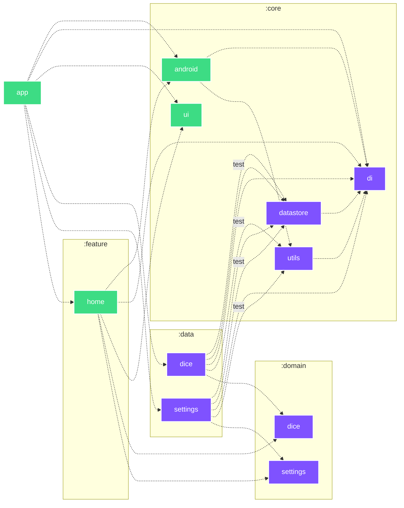

# 🛝 Android Playground

|                                      🌑                                      |                                       ☀️                                        |
|:----------------------------------------------------------------------------:|:-------------------------------------------------------------------------------:|
|  |  |

#### 🐘 Gradle

| Task                                                             | Description                                                                                 |
|------------------------------------------------------------------|---------------------------------------------------------------------------------------------|
| `gradlew assembleDebug`                                          | Build debug APK                                                                             |
| `gradlew assembleRelease`                                        | Build release APK (optimized & minified)                                                    |
| `gradlew apiCheck`                                               | Checks project public API ([BCV](https://github.com/Kotlin/binary-compatibility-validator)) |
| `gradlew apiDump`                                                | Dumps project public API ([BCV](https://github.com/Kotlin/binary-compatibility-validator))  |
| `gradlew dependencyGuard`                                        | Checks project dependencies                                                                 |
| `gradlew dependencyGuardBaseline`                                | Dumps project dependencies                                                                  |
| `gradlew globalCiBadging`                                        | CI badging checks                                                                           |
| `gradlew globalCiLint`                                           | CI Lint checks (html/sarif/txt/xml)                                                         |
| `gradlew globalCiUnitTest`                                       | CI unit tests (html/xml)                                                                    |
| `gradlew generateBaselineProfile`                                | Generates Baseline & Startup profiles                                                       |
| `gradlew connectedBenchmarkAndroidTest`                          | Runs benchmark tests                                                                        |
| `gradlew assembleRelease -Pplayground.compose.compilerMetrics`   | Compose compiler metrics                                                                    |
| `gradlew assembleRelease -Pplayground.compose.compilerReports`   | Compose compiler reports                                                                    |
| `gradlew --write-verification-metadata pgp,sha256 --export-keys` | Generates verification metadata & keyring                                                   |

#### 🐙 GitHub workflows

- 
- 
- 
- 
- 
- 
- 
- 

#### 🐙 GitHub composite actions

- [`📦 Archive JUnit reports`](.github/actions/archive-junit-reports/action.yaml)
- [`📦 Archive Lint reports`](.github/actions/archive-lint-reports/action.yaml)
- [`👮 Check git-lfs files`](.github/actions/check-git-lfs/action.yaml)
- [`🐘 Setup Gradle`](.github/actions/setup-gradle/action.yaml)
- [`🐘 Setup gradle.properties`](.github/actions/setup-gradle-properties/action.yaml)
- [`☕️ Setup Java`](.github/actions/setup-java/action.yaml)

<h4>🏗️ Architecture…</h4>

