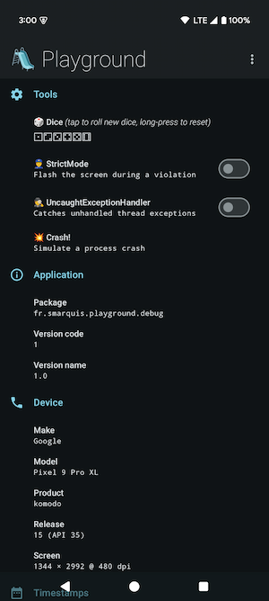
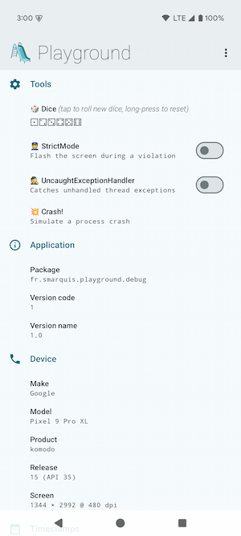
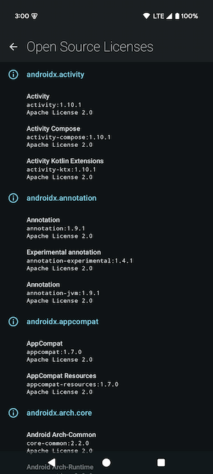
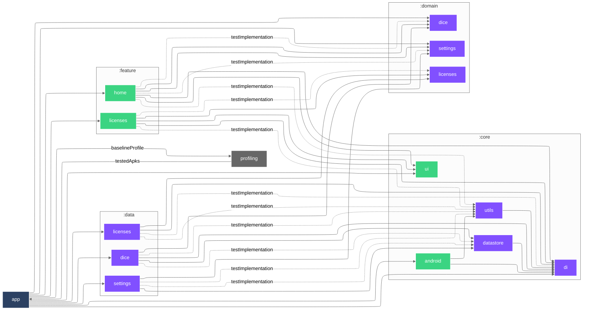

# 🛝 Android Playground

|                                                                                🌑                                                                                |                                                                                 ☀️                                                                                  |
|:----------------------------------------------------------------------------------------------------------------------------------------------------------------:|:-------------------------------------------------------------------------------------------------------------------------------------------------------------------:|
|                                                                                      |                                                                                      |
| 

📜 Open Source licenses…

 | 

📜 Open Source licenses…

 |

#### 🐘 Gradle

| Task                                                             | Description                                                                                 |
|------------------------------------------------------------------|---------------------------------------------------------------------------------------------|
| `gradlew assembleDebug`                                          | Build debug APK                                                                             |
| `gradlew assembleRelease`                                        | Build release APK (optimized & minified)                                                    |
| `gradlew apiCheck`                                               | Checks project public API ([BCV](https://github.com/Kotlin/binary-compatibility-validator)) |
| `gradlew apiDump`                                                | Dumps project public API ([BCV](https://github.com/Kotlin/binary-compatibility-validator))  |
| `gradlew licensee`                                               | Runs [Licensee](https://github.com/cashapp/licensee) dependency license validation          |
| `gradlew topologyCheck`                                          | Checks the topology of project dependencies                                                 |
| `gradlew dependencyLockState --write-locks`                      | Updates dependency lock state                                                               |
| `gradlew ciBadging -Pplayground.isMinifyEnabled=false`           | CI badging checks                                                                           |
| `gradlew globalCiLint`                                           | CI Lint checks (html/sarif/txt/xml)                                                         |
| `gradlew globalCiUnitTest`                                       | CI unit tests (html/xml)                                                                    |
| `gradlew verifyScreenshots`                                      | Verify screenshot tests images against golden images                                        |
| `gradlew recordScreenshots`                                      | Record screenshot tests golden images                                                       |
| `gradlew cleanRecordScreenshots`                                 | Clean and record screenshot tests golden images                                             |
| `gradlew generateBaselineProfile`                                | Generates Baseline & Startup profiles                                                       |
| `gradlew connectedBenchmarkAndroidTest`                          | Runs benchmark tests                                                                        |
| `gradlew assembleRelease -Pplayground.compose.compilerMetrics`   | Compose compiler metrics                                                                    |
| `gradlew assembleRelease -Pplayground.compose.compilerReports`   | Compose compiler reports                                                                    |
| `gradlew --write-verification-metadata pgp,sha256 --export-keys` | Generates verification metadata & keyring                                                   |

#### 🐙 GitHub workflows

- 
- 
- 
- 
- 
- 
- 
- 
- 
- 
- 

#### 🐙 GitHub composite actions

- [`📦 Archive Gradle reports`](.github/actions/archive-gradle-reports/action.yaml)
- [`📦 Archive JUnit reports`](.github/actions/archive-junit-reports/action.yaml)
- [`📦 Archive Lint reports`](.github/actions/archive-lint-reports/action.yaml)
- [`📦 Archive Paparazzi reports`](.github/actions/archive-paparazzi-reports/action.yaml)
- [`👮 Check git-lfs files`](.github/actions/check-git-lfs/action.yaml)
- [`🐘 Check Gradle dependency lock state`](.github/actions/check-gradle-dependency-lock-state/action.yaml)
- [`🤖 Setup Bot`](.github/actions/setup-bot/action.yaml)
- [`🐘 Setup Gradle`](.github/actions/setup-gradle/action.yaml)
- [`🐘 Setup gradle.properties`](.github/actions/setup-gradle-properties/action.yaml)
- [`☕️ Setup Java`](.github/actions/setup-java/action.yaml)

#### 🕵️ Lint checks

- 

<a href="https://github.com/SimonMarquis/Android-Playground/blob/main/lint/src/main/kotlin/fr/smarquis/playground/lint/AssertionsDetector.kt">AssertionsDetector</a>

  - Prefer using `kotlin.test` assertions instead of JUnit's in Kotlin unit tests.
  - Prefer using `kotlin.test` assertions instead of `assert` in unit tests. Its execution requires a specific JVM option to be enabled on the JVM.
  - Prefer using `assertIs` and `assertIsNot` assertions when checking for types instead of boolean assertions.
  - Prefer using `assertEquals`/`assertSame` and `assertNotEquals`/`assertNotSame` assertions when checking for equality instead of boolean assertions.

- 

<a href="https://github.com/SimonMarquis/Android-Playground/blob/main/lint/src/main/kotlin/fr/smarquis/playground/lint/GradleVersionCatalogDetector.kt">GradleVersionCatalogDetector</a>

  - Dependencies should be sorted alphabetically to maintain consistency and readability.
  - Dependencies should follow the configured regex.
  - Extracting a version in the `[versions]` section is useful only if it is used more than once or referenced elsewhere.
  - Dependency declaration should use the simplest form possible, omitting unnecessary inline tables.

- 

<a href="https://github.com/SimonMarquis/Android-Playground/blob/main/lint/src/main/kotlin/fr/smarquis/playground/lint/NamedParametersDetector.kt">NamedParametersDetector</a>

  - Not specifying parameters name using the same type can lead to unexpected results when refactoring methods signature.  
    Enforcing explicit named parameters also helps detecting mistakes during code review.  
    Quick fix: `⌥⏎` (macOS) or `Alt+Enter` (Windows/Linux) ➝ `Add names to call arguments`.

- 

<a href="https://github.com/SimonMarquis/Android-Playground/blob/main/lint/src/main/kotlin/fr/smarquis/playground/lint/ReplaceMethodCallDetector.kt">ReplaceMethodCallDetector</a>

  - The method `foo()` should not be called!

- 

<a href="https://github.com/SimonMarquis/Android-Playground/blob/main/lint/src/main/kotlin/fr/smarquis/playground/lint/TestMethodBannedWordsDetector.kt">TestMethodBannedWordsDetector</a>

  - Test methods name should not contains banned words.
    The default behavior checks for `failure,failed` words to reduce collisions when searching through logs.

- 

<a href="https://github.com/SimonMarquis/Android-Playground/blob/main/lint/src/main/kotlin/fr/smarquis/playground/lint/TypographyDetector.kt">TypographyDetector</a>

  - Escaped character are impossible to decipher for a human. Using unescaped character is generally self explanatory.
  - Typography can be replaced with a better alternative.
  - Curly quotes must be replaced with straight quote as Talkback does not properly handle them.

<h4>🏗️ Architecture…</h4>

[✨ Open with `mermaid.live`](https://mermaid.live/view#pako:eNqtV1tvmzAU_ivIfYUoobl6UqWtXaVJmzRtbxt7cINJvICNjFmbVf3vsw0k2DGQpmukYvv7zvHxuYGfwZrFGEAQBEFE14wmZAMj6nkp2rNSQA-nOzUVW5xh6MWIy6nmRnTDUb71Pn9TOMw5S0hK6OZnBA7jCPzSIMpzuSz_dy70iRflQ7UVjJFAasWrhjAmaywF1KPmDiOpXKIFLiTaDC1GgYWQuytGM_yPOjCNzUOtGce1qBpq-ULIkbK_GR_VVxyiD2evniFZCpIqq_TTxpTW0taKaMwZiVW8qtEFu7rtHdLca6sDO3FtzDJEaBMXPenIjArrj-v5nP4MGrbjFdmTYCTKQwLVs34jG9KWZcoC9TgFL9Sg7dMVfShDLwhu7FTpZhAX1HKZDY88gQvxKctT2aCoQIIw6o2GdxyQq9LK6EzSFC2D4_f5rqgMUx2MOrx2eqIeRtnHsLKug9l9mrfKW96QB1Z-eEAFlj7BX7Vz6igd-_aReWMmixsxjDug7RbhQGq_moultWgnjg0cqssEmzRxLLttNXq-hszs68jw7nRxwK5IWrShYiAXCB1j3w5kd4JbaNmF2qHpZBhuNVkXmj5YLR1GDcoZpho50d8ETdYZyl7f9c6WPTqtXYCn8e5ALXE9tYQVuk5RUdzhxNsxIVtG8PtP5snmkcKr5WQ2vr_3C8HZDsOrJEnqcfBIYrGFYf7kr1nKuMbeGcpKuqPskdaa5gv1u0xTfbBAVrislMpHldbwdjqZh2_TmpIHjvi-1nj94W66vEBj-312dGMLtnpQD4e4wVY59EhXMXbix5dnHZoWppqnw80txsl7yvLfiSGkh2G1T7e9Rr0P7Nbk_uCWh9Jz-9joxt0UpxbggwxzuUssr3DPSiQC-qoWAeipz3F5XQMRfZG8Mpdq8MeYyFwAMEFpgX2ASsG-7-kaQMFL3JDuCJJfl1mzmCP6g7H2FMBn8ATgKhxNxyv5N5mGs3A8n_tgD-BkuhpNw-twJtcXi1BiLz74qxWMR8v5ZLW6XixX80W4nE2kBNYWfaluofoy6gPOys32YOSGq-NVm3P5gYn5LSupAHD28g-FZQ6z)

