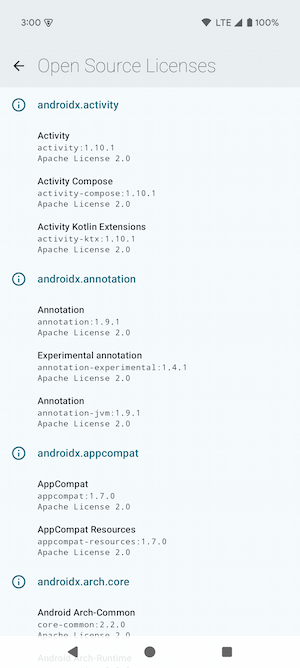

# 🛝 Android Playground

|                                                                                🌑                                                                                |                                                                                 ☀️                                                                                  |
|:----------------------------------------------------------------------------------------------------------------------------------------------------------------:|:-------------------------------------------------------------------------------------------------------------------------------------------------------------------:|
|                                                                                      |                                                                                      |
| 

📜 Open Source licenses…

 | 

📜 Open Source licenses…

 |

#### 🐘 Gradle

| Task                                                                      | Description                                                   |
|---------------------------------------------------------------------------|---------------------------------------------------------------|
| `gradlew assembleDebug`                                                   | Build debug APK                                               |
| `gradlew assembleRelease`                                                 | Build release APK (optimized & minified)                      |
| `gradlew checkLegacyAbi`                                                  | Checks project public API ([BCV][BCV])                        |
| `gradlew updateLegacyAbi`                                                 | Dumps project public API ([BCV][BCV])                         |
| `gradlew licensee`                                                        | Runs [Licensee][Licensee] dependency license validation       |
| `gradlew topologyCheck`                                                   | Checks the topology of project dependencies                   |
| `gradlew dependencyLockState --write-locks`                               | Updates dependency lock state                                 |
| `gradlew ciBadging -Pplayground.isMinifyEnabled=false`                    | CI badging checks                                             |
| `gradlew ciLint`                                                          | CI Lint checks (html/sarif/txt/xml)                           |
| `gradlew ciUnitTest`                                                      | CI unit tests (html/xml)                                      |
| `gradlew verifyScreenshots`                                               | Verify screenshot tests images against golden images          |
| `gradlew recordScreenshots`                                               | Record screenshot tests golden images                         |
| `gradlew cleanRecordScreenshots`                                          | Clean and record screenshot tests golden images               |
| `gradlew generateBaselineProfile`                                         | Generates Baseline & Startup profiles                         |
| `gradlew connectedBenchmarkAndroidTest`                                   | Runs benchmark tests                                          |
| `gradlew assembleRelease -Pplayground.compose.compilerMetrics`            | Compose compiler metrics                                      |
| `gradlew assembleRelease -Pplayground.compose.compilerReports`            | Compose compiler reports                                      |
| `gradlew globalCi --write-verification-metadata pgp,sha256 --export-keys` | Generates verification metadata & keyring                     |
| `gradlew graphDump -Dorg.gradle.unsafe.isolated-projects=false`           | Dumps project dependencies to a mermaid file                  |
| `gradlew graphUpdate -Dorg.gradle.unsafe.isolated-projects=false`         | Updates Markdown file with the corresponding dependency graph |
| `gradlew buildHealth`                                                     | Generates a build health report with [DAGP][DAGP]             |

[BCV]: https://kotlinlang.org/docs/gradle-binary-compatibility-validation.html
[DAGP]: https://github.com/autonomousapps/dependency-analysis-gradle-plugin
[Licensee]: https://github.com/cashapp/licensee

#### 🐙 GitHub workflows

- 
- 
- 
- 
- 
- 
- 
- 
- 
- 
- 
- 

#### 🐙 GitHub composite actions

- [`📦 Archive Gradle reports`](.github/actions/archive-gradle-reports/action.yaml)
- [`📦 Archive JUnit reports`](.github/actions/archive-junit-reports/action.yaml)
- [`📦 Archive Lint reports`](.github/actions/archive-lint-reports/action.yaml)
- [`📦 Archive Paparazzi reports`](.github/actions/archive-paparazzi-reports/action.yaml)
- [`👮 Check git-lfs files`](.github/actions/check-git-lfs/action.yaml)
- [`🐘 Check Gradle dependency lock state`](.github/actions/check-gradle-dependency-lock-state/action.yaml)
- [`🤖 Setup Bot`](.github/actions/setup-bot/action.yaml)
- [`🐘 Setup Gradle`](.github/actions/setup-gradle/action.yaml)
- [`🐘 Setup gradle.properties`](.github/actions/setup-gradle-properties/action.yaml)
- [`☕️ Setup Java`](.github/actions/setup-java/action.yaml)

#### 🕵️ Lint checks

- 

<a href="https://github.com/SimonMarquis/Android-Playground/blob/main/lint/src/main/kotlin/fr/smarquis/playground/lint/AssertionsDetector.kt">AssertionsDetector</a>

  - Prefer using `kotlin.test` assertions instead of JUnit's in Kotlin unit tests.
  - Prefer using `kotlin.test` assertions instead of `assert` in unit tests. Its execution requires a specific JVM option to be enabled on the JVM.
  - Prefer using `assertIs` and `assertIsNot` assertions when checking for types instead of boolean assertions.
  - Prefer using `assertNull`/`assertNotNull` assertions when checking for null/non-null values instead of equality assertions.
  - Prefer using `assertEquals`/`assertSame` and `assertNotEquals`/`assertNotSame` assertions when checking for equality instead of boolean assertions.

- 

<a href="https://github.com/SimonMarquis/Android-Playground/blob/main/lint/src/main/kotlin/fr/smarquis/playground/lint/GradleVersionCatalogDetector.kt">GradleVersionCatalogDetector</a>

  - Dependencies should be sorted alphabetically to maintain consistency and readability.
  - Dependencies should follow the configured regex.
  - Extracting a version in the `[versions]` section is useful only if it is used more than once or referenced elsewhere.
  - Dependency declaration should use the simplest form possible, omitting unnecessary inline tables.

- 

<a href="https://github.com/SimonMarquis/Android-Playground/blob/main/lint/src/main/kotlin/fr/smarquis/playground/lint/NamedParametersDetector.kt">NamedParametersDetector</a>

  - Not specifying parameters name using the same type can lead to unexpected results when refactoring methods signature.  
    Enforcing explicit named parameters also helps detecting mistakes during code review.  
    Quick fix: `⌥⏎` (macOS) or `Alt+Enter` (Windows/Linux) ➝ `Add names to call arguments`.
  - Using a variable for a function call parameter while another parameter with the exact same name exists is probably a bug.

- 

<a href="https://github.com/SimonMarquis/Android-Playground/blob/main/lint/src/main/kotlin/fr/smarquis/playground/lint/ReplaceMethodCallDetector.kt">ReplaceMethodCallDetector</a>

  - The method `foo()` should not be called!

- 

<a href="https://github.com/SimonMarquis/Android-Playground/blob/main/lint/src/main/kotlin/fr/smarquis/playground/lint/TestMethodBannedWordsDetector.kt">TestMethodBannedWordsDetector</a>

  - Test methods name should not contains banned words.
    The default behavior checks for `failure,failed` words to reduce collisions when searching through logs.

- 

<a href="https://github.com/SimonMarquis/Android-Playground/blob/main/lint/src/main/kotlin/fr/smarquis/playground/lint/TypographyDetector.kt">TypographyDetector</a>

  - Escaped character are impossible to decipher for a human. Using unescaped character is generally self explanatory.
  - Typography can be replaced with a better alternative.
  - Curly quotes must be replaced with straight quote as Talkback does not properly handle them.

#### 🏗️ Architecture

<!--region graph-->
> [!TIP]
> [✨ View in `mermaid.live`](https://mermaid.live/view#base64:eyJjb2RlIjoiLS0tXG5jb25maWc6XG4gIGxheW91dDogZWxrXG4gIGVsazpcbiAgICBub2RlUGxhY2VtZW50U3RyYXRlZ3k6IFNJTVBMRVxuLS0tXG5ncmFwaCBUQlxuICBzdWJncmFwaCA6Y29yZSBbY29yZV1cbiAgICBkaXJlY3Rpb24gVEJcbiAgICA6Y29yZTphbmRyb2lkW2FuZHJvaWRdOjo6YW5kcm9pZC1saWJyYXJ5XG4gICAgOmNvcmU6ZGF0YXN0b3JlW2RhdGFzdG9yZV06Ojpqdm1cbiAgICA6Y29yZTpkaVtkaV06Ojpqdm1cbiAgICA6Y29yZTp1aVt1aV06OjphbmRyb2lkLWxpYnJhcnlcbiAgICA6Y29yZTp1dGlsc1t1dGlsc106Ojpqdm1cbiAgZW5kXG4gIHN1YmdyYXBoIDpkb21haW4gW2RvbWFpbl1cbiAgICBkaXJlY3Rpb24gVEJcbiAgICA6ZG9tYWluOmRpY2VbZGljZV06Ojpqdm1cbiAgICA6ZG9tYWluOmxpY2Vuc2VzW2xpY2Vuc2VzXTo6Omp2bVxuICAgIDpkb21haW46c2V0dGluZ3Nbc2V0dGluZ3NdOjo6anZtXG4gIGVuZFxuICBzdWJncmFwaCA6ZGF0YSBbZGF0YV1cbiAgICBkaXJlY3Rpb24gVEJcbiAgICA6ZGF0YTpkaWNlW2RpY2VdOjo6anZtXG4gICAgOmRhdGE6bGljZW5zZXNbbGljZW5zZXNdOjo6anZtXG4gICAgOmRhdGE6c2V0dGluZ3Nbc2V0dGluZ3NdOjo6anZtXG4gIGVuZFxuICBzdWJncmFwaCA6ZmVhdHVyZSBbZmVhdHVyZV1cbiAgICBkaXJlY3Rpb24gVEJcbiAgICA6ZmVhdHVyZTpob21lW2hvbWVdOjo6anZtXG4gICAgOmZlYXR1cmU6bGljZW5zZXNbbGljZW5zZXNdOjo6anZtXG4gIGVuZFxuICBzdWJncmFwaCA6ZmVhdHVyZTpob21lIFtob21lXVxuICAgIGRpcmVjdGlvbiBUQlxuICAgIDpmZWF0dXJlOmhvbWU6aW1wbFtpbXBsXTo6OmFuZHJvaWQtbGlicmFyeVxuICBlbmRcbiAgc3ViZ3JhcGggOmZlYXR1cmU6bGljZW5zZXMgW2xpY2Vuc2VzXVxuICAgIGRpcmVjdGlvbiBUQlxuICAgIDpmZWF0dXJlOmxpY2Vuc2VzOmltcGxbaW1wbF06OjphbmRyb2lkLWxpYnJhcnlcbiAgZW5kXG4gIDpwcm9maWxpbmdbcHJvZmlsaW5nXTo6OmFuZHJvaWQtdGVzdFxuICA6YXBwW2FwcF06OjphbmRyb2lkLWFwcGxpY2F0aW9uXG5cbiAgOmFwcCAtLi0-IDpjb3JlOmFuZHJvaWRcbiAgOmFwcCAtLi0-IDpjb3JlOmRpXG4gIDphcHAgLS4tPiA6Y29yZTp1aVxuICA6YXBwIC0uLT4gOmNvcmU6dXRpbHNcbiAgOmFwcCAtLi0-IDpkYXRhOmRpY2VcbiAgOmFwcCAtLi0-IDpkYXRhOmxpY2Vuc2VzXG4gIDphcHAgLS4tPiA6ZGF0YTpzZXR0aW5nc1xuICA6YXBwIC0uLT4gOmRvbWFpbjpkaWNlXG4gIDphcHAgLS4tPiA6ZG9tYWluOnNldHRpbmdzXG4gIDphcHAgLS4tPiA6ZmVhdHVyZTpob21lOmltcGxcbiAgOmFwcCAtLi0-IDpmZWF0dXJlOmxpY2Vuc2VzOmltcGxcbiAgOmFwcCAtLi0-fGJhc2VsaW5lUHJvZmlsZXwgOnByb2ZpbGluZ1xuICA6Y29yZTphbmRyb2lkIC0uLT4gOmNvcmU6ZGlcbiAgOmNvcmU6YW5kcm9pZCAtLi0-IDpjb3JlOnV0aWxzXG4gIDpjb3JlOmRhdGFzdG9yZSAtLi0-IDpjb3JlOmRpXG4gIDpjb3JlOnV0aWxzIC0uLT4gOmNvcmU6ZGlcbiAgOmRhdGE6ZGljZSAtLi0-IDpjb3JlOmRhdGFzdG9yZVxuICA6ZGF0YTpkaWNlIC0uLT4gOmNvcmU6ZGlcbiAgOmRhdGE6ZGljZSAtLS0-IDpkb21haW46ZGljZVxuICA6ZGF0YTpsaWNlbnNlcyAtLi0-IDpjb3JlOmRpXG4gIDpkYXRhOmxpY2Vuc2VzIC0tLT4gOmRvbWFpbjpsaWNlbnNlc1xuICA6ZGF0YTpzZXR0aW5ncyAtLi0-IDpjb3JlOmRhdGFzdG9yZVxuICA6ZGF0YTpzZXR0aW5ncyAtLS0-IDpkb21haW46c2V0dGluZ3NcbiAgOmZlYXR1cmU6aG9tZTppbXBsIC0uLT4gOmNvcmU6ZGlcbiAgOmZlYXR1cmU6aG9tZTppbXBsIC0uLT4gOmNvcmU6dWlcbiAgOmZlYXR1cmU6aG9tZTppbXBsIC0uLT4gOmNvcmU6dXRpbHNcbiAgOmZlYXR1cmU6aG9tZTppbXBsIC0tLT4gOmRvbWFpbjpkaWNlXG4gIDpmZWF0dXJlOmhvbWU6aW1wbCAtLS0-IDpkb21haW46c2V0dGluZ3NcbiAgOmZlYXR1cmU6aG9tZTppbXBsIC0tLT4gOmZlYXR1cmU6aG9tZVxuICA6ZmVhdHVyZTpob21lOmltcGwgLS4tPiA6ZmVhdHVyZTpsaWNlbnNlc1xuICA6ZmVhdHVyZTpsaWNlbnNlczppbXBsIC0uLT4gOmNvcmU6ZGlcbiAgOmZlYXR1cmU6bGljZW5zZXM6aW1wbCAtLi0-IDpjb3JlOnVpXG4gIDpmZWF0dXJlOmxpY2Vuc2VzOmltcGwgLS4tPiA6Y29yZTp1dGlsc1xuICA6ZmVhdHVyZTpsaWNlbnNlczppbXBsIC0tLT4gOmRvbWFpbjpsaWNlbnNlc1xuICA6ZmVhdHVyZTpsaWNlbnNlczppbXBsIC0tLT4gOmZlYXR1cmU6bGljZW5zZXNcbiAgOnByb2ZpbGluZyAtLi0-fHRlc3RlZEFwa3N8IDphcHBcblxuY2xhc3NEZWYgYW5kcm9pZC1hcHBsaWNhdGlvbiBmaWxsOiMyQzQxNjIsc3Ryb2tlOiNmZmYsc3Ryb2tlLXdpZHRoOjJweCxjb2xvcjojZmZmO1xuY2xhc3NEZWYgYW5kcm9pZC1saWJyYXJ5IGZpbGw6IzNCRDQ4MixzdHJva2U6I2ZmZixzdHJva2Utd2lkdGg6MnB4LGNvbG9yOiNmZmY7XG5jbGFzc0RlZiBhbmRyb2lkLXRlc3QgZmlsbDojM0JENDgyLHN0cm9rZTojZmZmLHN0cm9rZS13aWR0aDoycHgsY29sb3I6I2ZmZjtcbmNsYXNzRGVmIGp2bSBmaWxsOiM3RjUyRkYsc3Ryb2tlOiNmZmYsc3Ryb2tlLXdpZHRoOjJweCxjb2xvcjojZmZmOyJ9)

<!--endregion-->
