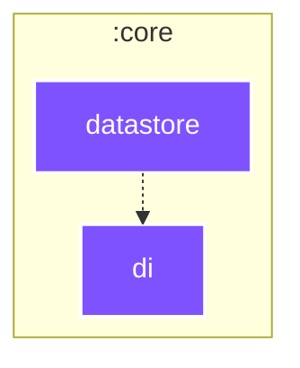

# `:core:datastore`

<!--region graph-->

[✨ View in `mermaid.live`](https://mermaid.live/view#base64:eyJjb2RlIjoiLS0tXG5jb25maWc6XG4gIGxheW91dDogZWxrXG4gIGVsazpcbiAgICBub2RlUGxhY2VtZW50U3RyYXRlZ3k6IFNJTVBMRVxuLS0tXG5ncmFwaCBUQlxuICBzdWJncmFwaCA6Y29yZVxuICAgIGRpcmVjdGlvbiBUQlxuICAgIDpjb3JlOmRhdGFzdG9yZVtkYXRhc3RvcmVdOjo6anZtXG4gICAgOmNvcmU6ZGlbZGldOjo6anZtXG4gIGVuZFxuXG4gIDpjb3JlOmRhdGFzdG9yZSAtLi0-IDpjb3JlOmRpXG5cbmNsYXNzRGVmIGFuZHJvaWQtYXBwbGljYXRpb24gZmlsbDojMkM0MTYyLHN0cm9rZTojZmZmLHN0cm9rZS13aWR0aDoycHgsY29sb3I6I2ZmZjtcbmNsYXNzRGVmIGFuZHJvaWQtbGlicmFyeSBmaWxsOiMzQkQ0ODIsc3Ryb2tlOiNmZmYsc3Ryb2tlLXdpZHRoOjJweCxjb2xvcjojZmZmO1xuY2xhc3NEZWYgYW5kcm9pZC10ZXN0IGZpbGw6IzNCRDQ4MixzdHJva2U6I2ZmZixzdHJva2Utd2lkdGg6MnB4LGNvbG9yOiNmZmY7XG5jbGFzc0RlZiBqdm0gZmlsbDojN0Y1MkZGLHN0cm9rZTojZmZmLHN0cm9rZS13aWR0aDoycHgsY29sb3I6I2ZmZjsifQ==)
<!--endregion-->
