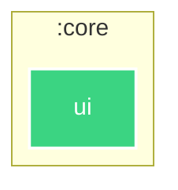

# `:core:ui`

<!--region graph-->

[✨ View in `mermaid.live`](https://mermaid.live/view#base64:eyJjb2RlIjoiLS0tXG5jb25maWc6XG4gIGxheW91dDogZWxrXG4gIGVsazpcbiAgICBub2RlUGxhY2VtZW50U3RyYXRlZ3k6IFNJTVBMRVxuLS0tXG5ncmFwaCBUQlxuICBzdWJncmFwaCA6Y29yZVxuICAgIGRpcmVjdGlvbiBUQlxuICAgIDpjb3JlOnVpW3VpXTo6OmFuZHJvaWQtbGlicmFyeVxuICBlbmRcblxuY2xhc3NEZWYgYW5kcm9pZC1hcHBsaWNhdGlvbiBmaWxsOiMyQzQxNjIsc3Ryb2tlOiNmZmYsc3Ryb2tlLXdpZHRoOjJweCxjb2xvcjojZmZmO1xuY2xhc3NEZWYgYW5kcm9pZC1saWJyYXJ5IGZpbGw6IzNCRDQ4MixzdHJva2U6I2ZmZixzdHJva2Utd2lkdGg6MnB4LGNvbG9yOiNmZmY7XG5jbGFzc0RlZiBhbmRyb2lkLXRlc3QgZmlsbDojM0JENDgyLHN0cm9rZTojZmZmLHN0cm9rZS13aWR0aDoycHgsY29sb3I6I2ZmZjtcbmNsYXNzRGVmIGp2bSBmaWxsOiM3RjUyRkYsc3Ryb2tlOiNmZmYsc3Ryb2tlLXdpZHRoOjJweCxjb2xvcjojZmZmOyJ9)
<!--endregion-->
