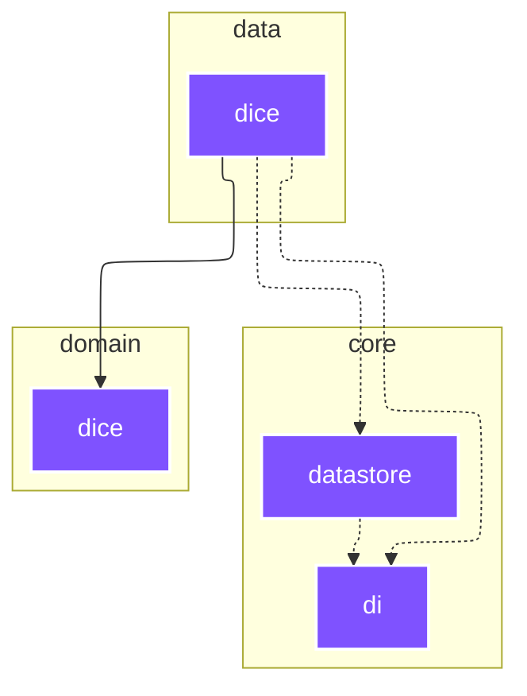

# `:data:dice`

<!--region graph-->
> [!TIP]
> [✨ View in `mermaid.live`](https://mermaid.live/view#base64:eyJjb2RlIjoiLS0tXG5jb25maWc6XG4gIGxheW91dDogZWxrXG4gIGVsazpcbiAgICBub2RlUGxhY2VtZW50U3RyYXRlZ3k6IFNJTVBMRVxuLS0tXG5ncmFwaCBUQlxuICBzdWJncmFwaCA6Y29yZSBbY29yZV1cbiAgICBkaXJlY3Rpb24gVEJcbiAgICA6Y29yZTpkYXRhc3RvcmVbZGF0YXN0b3JlXTo6Omp2bVxuICAgIDpjb3JlOmRpW2RpXTo6Omp2bVxuICBlbmRcbiAgc3ViZ3JhcGggOmRhdGEgW2RhdGFdXG4gICAgZGlyZWN0aW9uIFRCXG4gICAgOmRhdGE6ZGljZVtkaWNlXTo6Omp2bVxuICBlbmRcbiAgc3ViZ3JhcGggOmRvbWFpbiBbZG9tYWluXVxuICAgIGRpcmVjdGlvbiBUQlxuICAgIDpkb21haW46ZGljZVtkaWNlXTo6Omp2bVxuICBlbmRcblxuICA6Y29yZTpkYXRhc3RvcmUgLS4tPiA6Y29yZTpkaVxuICA6ZGF0YTpkaWNlIC0uLT4gOmNvcmU6ZGF0YXN0b3JlXG4gIDpkYXRhOmRpY2UgLS4tPiA6Y29yZTpkaVxuICA6ZGF0YTpkaWNlIC0tLT4gOmRvbWFpbjpkaWNlXG5cbmNsYXNzRGVmIGFuZHJvaWQtYXBwbGljYXRpb24gZmlsbDojMkM0MTYyLHN0cm9rZTojZmZmLHN0cm9rZS13aWR0aDoycHgsY29sb3I6I2ZmZjtcbmNsYXNzRGVmIGFuZHJvaWQtbGlicmFyeSBmaWxsOiMzQkQ0ODIsc3Ryb2tlOiNmZmYsc3Ryb2tlLXdpZHRoOjJweCxjb2xvcjojZmZmO1xuY2xhc3NEZWYgYW5kcm9pZC10ZXN0IGZpbGw6IzNCRDQ4MixzdHJva2U6I2ZmZixzdHJva2Utd2lkdGg6MnB4LGNvbG9yOiNmZmY7XG5jbGFzc0RlZiBqdm0gZmlsbDojN0Y1MkZGLHN0cm9rZTojZmZmLHN0cm9rZS13aWR0aDoycHgsY29sb3I6I2ZmZjsifQ==)

<!--endregion-->
