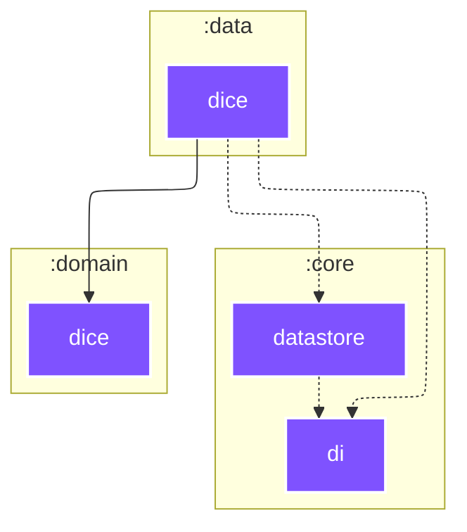

# `:data:dice`

<!--region graph-->

[✨ View in `mermaid.live`](https://mermaid.live/view#base64:eyJjb2RlIjoiLS0tXG5jb25maWc6XG4gIGxheW91dDogZWxrXG4gIGVsazpcbiAgICBub2RlUGxhY2VtZW50U3RyYXRlZ3k6IFNJTVBMRVxuLS0tXG5ncmFwaCBUQlxuICBzdWJncmFwaCA6Y29yZVxuICAgIDpjb3JlOmRhdGFzdG9yZVtkYXRhc3RvcmVdOjo6anZtXG4gICAgOmNvcmU6ZGlbZGldOjo6anZtXG4gIGVuZFxuICBzdWJncmFwaCA6ZGF0YVxuICAgIDpkYXRhOmRpY2VbZGljZV06Ojpqdm1cbiAgZW5kXG4gIHN1YmdyYXBoIDpkb21haW5cbiAgICA6ZG9tYWluOmRpY2VbZGljZV06Ojpqdm1cbiAgZW5kXG5cbiAgOmNvcmU6ZGF0YXN0b3JlIC0uLT4gOmNvcmU6ZGlcbiAgOmRhdGE6ZGljZSAtLi0-IDpjb3JlOmRhdGFzdG9yZVxuICA6ZGF0YTpkaWNlIC0uLT4gOmNvcmU6ZGlcbiAgOmRhdGE6ZGljZSAtLS0-IDpkb21haW46ZGljZVxuXG5jbGFzc0RlZiBhbmRyb2lkLWFwcGxpY2F0aW9uIGZpbGw6IzJDNDE2MixzdHJva2U6I2ZmZixzdHJva2Utd2lkdGg6MnB4LGNvbG9yOiNmZmY7XG5jbGFzc0RlZiBhbmRyb2lkLWxpYnJhcnkgZmlsbDojM0JENDgyLHN0cm9rZTojZmZmLHN0cm9rZS13aWR0aDoycHgsY29sb3I6I2ZmZjtcbmNsYXNzRGVmIGFuZHJvaWQtdGVzdCBmaWxsOiMzQkQ0ODIsc3Ryb2tlOiNmZmYsc3Ryb2tlLXdpZHRoOjJweCxjb2xvcjojZmZmO1xuY2xhc3NEZWYganZtIGZpbGw6IzdGNTJGRixzdHJva2U6I2ZmZixzdHJva2Utd2lkdGg6MnB4LGNvbG9yOiNmZmY7In0=)
<!--endregion-->
