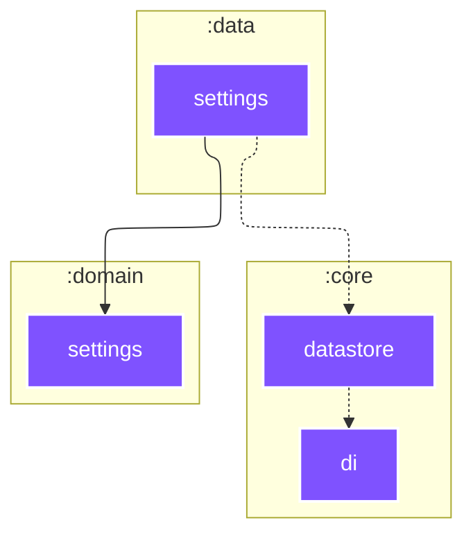

# `:data:settings`

<!--region graph-->
> [!TIP]
> [✨ View in `mermaid.live`](https://mermaid.live/view#base64:eyJjb2RlIjoiLS0tXG5jb25maWc6XG4gIGxheW91dDogZWxrXG4gIGVsazpcbiAgICBub2RlUGxhY2VtZW50U3RyYXRlZ3k6IFNJTVBMRVxuLS0tXG5ncmFwaCBUQlxuICBzdWJncmFwaCA6Y29yZVxuICAgIGRpcmVjdGlvbiBUQlxuICAgIDpjb3JlOmRhdGFzdG9yZVtkYXRhc3RvcmVdOjo6anZtXG4gICAgOmNvcmU6ZGlbZGldOjo6anZtXG4gIGVuZFxuICBzdWJncmFwaCA6ZGF0YVxuICAgIGRpcmVjdGlvbiBUQlxuICAgIDpkYXRhOnNldHRpbmdzW3NldHRpbmdzXTo6Omp2bVxuICBlbmRcbiAgc3ViZ3JhcGggOmRvbWFpblxuICAgIGRpcmVjdGlvbiBUQlxuICAgIDpkb21haW46c2V0dGluZ3Nbc2V0dGluZ3NdOjo6anZtXG4gIGVuZFxuXG4gIDpjb3JlOmRhdGFzdG9yZSAtLi0-IDpjb3JlOmRpXG4gIDpkYXRhOnNldHRpbmdzIC0uLT4gOmNvcmU6ZGF0YXN0b3JlXG4gIDpkYXRhOnNldHRpbmdzIC0tLT4gOmRvbWFpbjpzZXR0aW5nc1xuXG5jbGFzc0RlZiBhbmRyb2lkLWFwcGxpY2F0aW9uIGZpbGw6IzJDNDE2MixzdHJva2U6I2ZmZixzdHJva2Utd2lkdGg6MnB4LGNvbG9yOiNmZmY7XG5jbGFzc0RlZiBhbmRyb2lkLWxpYnJhcnkgZmlsbDojM0JENDgyLHN0cm9rZTojZmZmLHN0cm9rZS13aWR0aDoycHgsY29sb3I6I2ZmZjtcbmNsYXNzRGVmIGFuZHJvaWQtdGVzdCBmaWxsOiMzQkQ0ODIsc3Ryb2tlOiNmZmYsc3Ryb2tlLXdpZHRoOjJweCxjb2xvcjojZmZmO1xuY2xhc3NEZWYganZtIGZpbGw6IzdGNTJGRixzdHJva2U6I2ZmZixzdHJva2Utd2lkdGg6MnB4LGNvbG9yOiNmZmY7In0=)

<!--endregion-->
