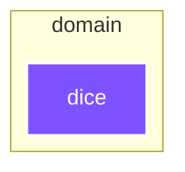

# `:domain:dice`

<!--region graph-->
> [!TIP]
> [✨ View in `mermaid.live`](https://mermaid.live/view#base64:eyJjb2RlIjoiLS0tXG5jb25maWc6XG4gIGxheW91dDogZWxrXG4gIGVsazpcbiAgICBub2RlUGxhY2VtZW50U3RyYXRlZ3k6IFNJTVBMRVxuLS0tXG5ncmFwaCBUQlxuICBzdWJncmFwaCA6ZG9tYWluIFtkb21haW5dXG4gICAgZGlyZWN0aW9uIFRCXG4gICAgOmRvbWFpbjpkaWNlW2RpY2VdOjo6anZtXG4gIGVuZFxuXG5jbGFzc0RlZiBhbmRyb2lkLWFwcGxpY2F0aW9uIGZpbGw6IzJDNDE2MixzdHJva2U6I2ZmZixzdHJva2Utd2lkdGg6MnB4LGNvbG9yOiNmZmY7XG5jbGFzc0RlZiBhbmRyb2lkLWxpYnJhcnkgZmlsbDojM0JENDgyLHN0cm9rZTojZmZmLHN0cm9rZS13aWR0aDoycHgsY29sb3I6I2ZmZjtcbmNsYXNzRGVmIGFuZHJvaWQtdGVzdCBmaWxsOiMzQkQ0ODIsc3Ryb2tlOiNmZmYsc3Ryb2tlLXdpZHRoOjJweCxjb2xvcjojZmZmO1xuY2xhc3NEZWYganZtIGZpbGw6IzdGNTJGRixzdHJva2U6I2ZmZixzdHJva2Utd2lkdGg6MnB4LGNvbG9yOiNmZmY7In0=)

<!--endregion-->
