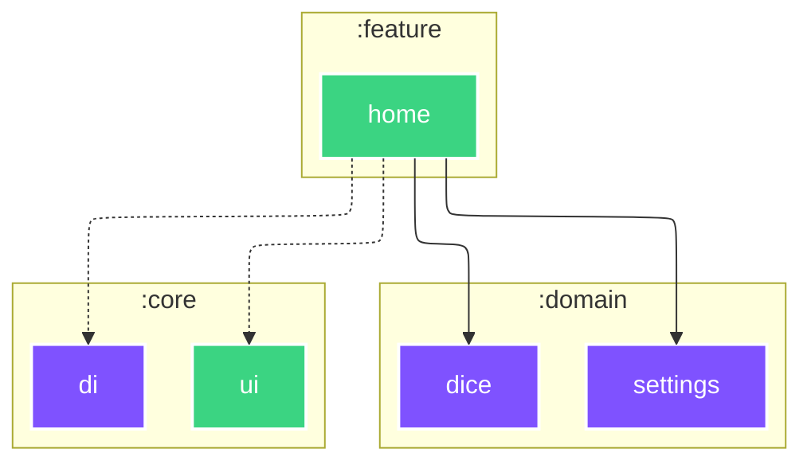

# `:feature:home`

<!--region graph-->

[✨ View in `mermaid.live`](https://mermaid.live/view#base64:eyJjb2RlIjoiLS0tXG5jb25maWc6XG4gIGxheW91dDogZWxrXG4gIGVsazpcbiAgICBub2RlUGxhY2VtZW50U3RyYXRlZ3k6IFNJTVBMRVxuLS0tXG5ncmFwaCBUQlxuICBzdWJncmFwaCA6ZG9tYWluXG4gICAgOmRvbWFpbjpkaWNlW2RpY2VdOjo6anZtXG4gICAgOmRvbWFpbjpzZXR0aW5nc1tzZXR0aW5nc106Ojpqdm1cbiAgZW5kXG4gIHN1YmdyYXBoIDpjb3JlXG4gICAgOmNvcmU6ZGlbZGldOjo6anZtXG4gICAgOmNvcmU6dWlbdWldOjo6YW5kcm9pZC1saWJyYXJ5XG4gIGVuZFxuICBzdWJncmFwaCA6ZmVhdHVyZVxuICAgIDpmZWF0dXJlOmhvbWVbaG9tZV06OjphbmRyb2lkLWxpYnJhcnlcbiAgZW5kXG5cbiAgOmZlYXR1cmU6aG9tZSAtLi0-IDpjb3JlOmRpXG4gIDpmZWF0dXJlOmhvbWUgLS4tPiA6Y29yZTp1aVxuICA6ZmVhdHVyZTpob21lIC0tLT4gOmRvbWFpbjpkaWNlXG4gIDpmZWF0dXJlOmhvbWUgLS0tPiA6ZG9tYWluOnNldHRpbmdzXG5cbmNsYXNzRGVmIGFuZHJvaWQtYXBwbGljYXRpb24gZmlsbDojMkM0MTYyLHN0cm9rZTojZmZmLHN0cm9rZS13aWR0aDoycHgsY29sb3I6I2ZmZjtcbmNsYXNzRGVmIGFuZHJvaWQtbGlicmFyeSBmaWxsOiMzQkQ0ODIsc3Ryb2tlOiNmZmYsc3Ryb2tlLXdpZHRoOjJweCxjb2xvcjojZmZmO1xuY2xhc3NEZWYgYW5kcm9pZC10ZXN0IGZpbGw6IzNCRDQ4MixzdHJva2U6I2ZmZixzdHJva2Utd2lkdGg6MnB4LGNvbG9yOiNmZmY7XG5jbGFzc0RlZiBqdm0gZmlsbDojN0Y1MkZGLHN0cm9rZTojZmZmLHN0cm9rZS13aWR0aDoycHgsY29sb3I6I2ZmZjsifQ==)
<!--endregion-->
