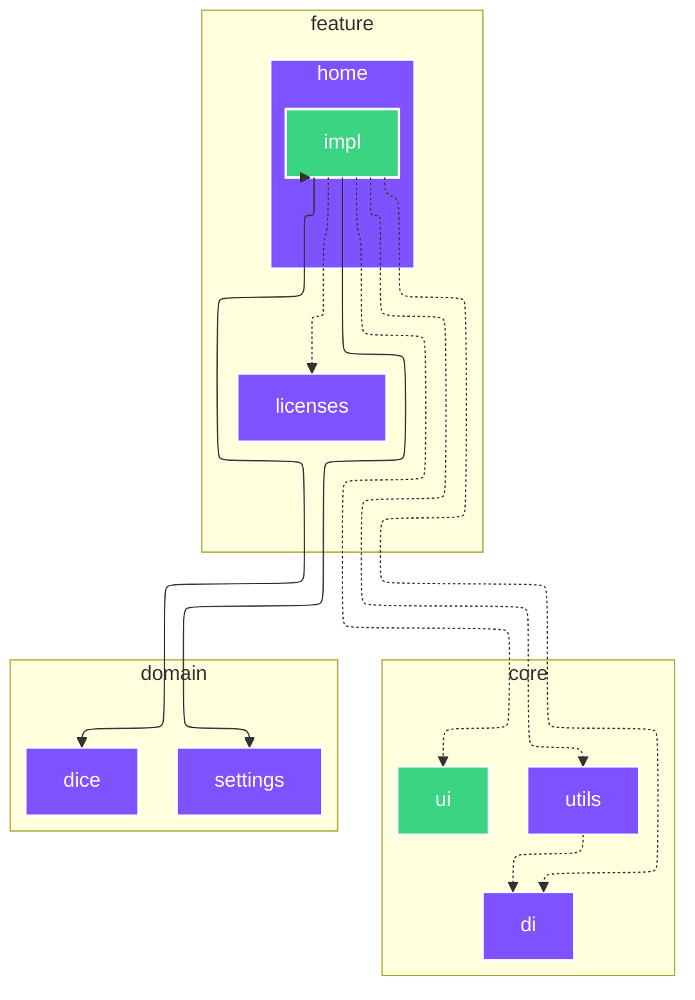

# `:feature:home`

<!--region graph-->
> [!TIP]
> [✨ View in `mermaid.live`](https://mermaid.live/view#base64:eyJjb2RlIjoiLS0tXG5jb25maWc6XG4gIGxheW91dDogZWxrXG4gIGVsazpcbiAgICBub2RlUGxhY2VtZW50U3RyYXRlZ3k6IFNJTVBMRVxuLS0tXG5ncmFwaCBUQlxuICBzdWJncmFwaCA6Y29yZSBbY29yZV1cbiAgICBkaXJlY3Rpb24gVEJcbiAgICA6Y29yZTpkaVtkaV06Ojpqdm1cbiAgICA6Y29yZTp1aVt1aV06OjphbmRyb2lkLWxpYnJhcnlcbiAgICA6Y29yZTp1dGlsc1t1dGlsc106Ojpqdm1cbiAgZW5kXG4gIHN1YmdyYXBoIDpkb21haW4gW2RvbWFpbl1cbiAgICBkaXJlY3Rpb24gVEJcbiAgICA6ZG9tYWluOmRpY2VbZGljZV06Ojpqdm1cbiAgICA6ZG9tYWluOnNldHRpbmdzW3NldHRpbmdzXTo6Omp2bVxuICBlbmRcbiAgc3ViZ3JhcGggOmZlYXR1cmUgW2ZlYXR1cmVdXG4gICAgZGlyZWN0aW9uIFRCXG4gICAgOmZlYXR1cmU6aG9tZVtob21lXTo6Omp2bVxuICAgIDpmZWF0dXJlOmxpY2Vuc2VzW2xpY2Vuc2VzXTo6Omp2bVxuICBlbmRcbiAgc3ViZ3JhcGggOmZlYXR1cmU6aG9tZSBbaG9tZV1cbiAgICBkaXJlY3Rpb24gVEJcbiAgICA6ZmVhdHVyZTpob21lOmltcGxbaW1wbF06OjphbmRyb2lkLWxpYnJhcnlcbiAgZW5kXG5cbiAgOmNvcmU6dXRpbHMgLS4tPiA6Y29yZTpkaVxuICA6ZmVhdHVyZTpob21lOmltcGwgLS4tPiA6Y29yZTpkaVxuICA6ZmVhdHVyZTpob21lOmltcGwgLS4tPiA6Y29yZTp1aVxuICA6ZmVhdHVyZTpob21lOmltcGwgLS4tPiA6Y29yZTp1dGlsc1xuICA6ZmVhdHVyZTpob21lOmltcGwgLS0tPiA6ZG9tYWluOmRpY2VcbiAgOmZlYXR1cmU6aG9tZTppbXBsIC0tLT4gOmRvbWFpbjpzZXR0aW5nc1xuICA6ZmVhdHVyZTpob21lOmltcGwgLS0tPiA6ZmVhdHVyZTpob21lXG4gIDpmZWF0dXJlOmhvbWU6aW1wbCAtLi0-IDpmZWF0dXJlOmxpY2Vuc2VzXG5cbmNsYXNzRGVmIGFuZHJvaWQtYXBwbGljYXRpb24gZmlsbDojMkM0MTYyLHN0cm9rZTojZmZmLHN0cm9rZS13aWR0aDoycHgsY29sb3I6I2ZmZjtcbmNsYXNzRGVmIGFuZHJvaWQtbGlicmFyeSBmaWxsOiMzQkQ0ODIsc3Ryb2tlOiNmZmYsc3Ryb2tlLXdpZHRoOjJweCxjb2xvcjojZmZmO1xuY2xhc3NEZWYgYW5kcm9pZC10ZXN0IGZpbGw6IzNCRDQ4MixzdHJva2U6I2ZmZixzdHJva2Utd2lkdGg6MnB4LGNvbG9yOiNmZmY7XG5jbGFzc0RlZiBqdm0gZmlsbDojN0Y1MkZGLHN0cm9rZTojZmZmLHN0cm9rZS13aWR0aDoycHgsY29sb3I6I2ZmZjsifQ==)

<!--endregion-->
