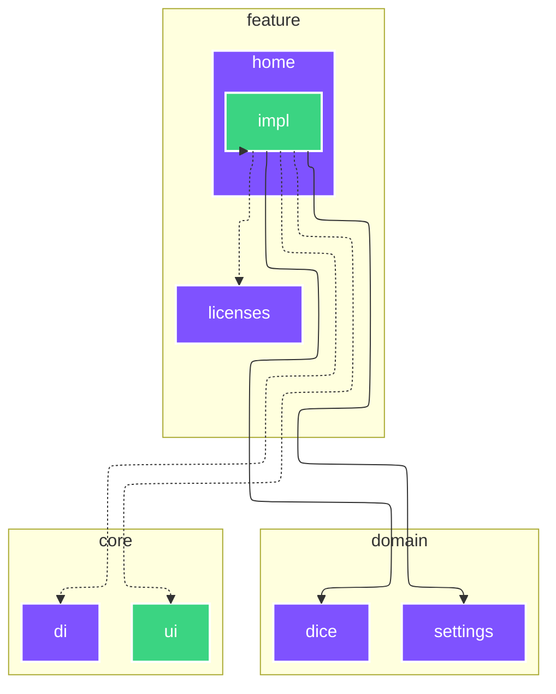

# `:feature:home`

<!--region graph-->
> [!TIP]
> [✨ View in `mermaid.live`](https://mermaid.live/view#base64:eyJjb2RlIjoiLS0tXG5jb25maWc6XG4gIGxheW91dDogZWxrXG4gIGVsazpcbiAgICBub2RlUGxhY2VtZW50U3RyYXRlZ3k6IFNJTVBMRVxuLS0tXG5ncmFwaCBUQlxuICBzdWJncmFwaCA6ZG9tYWluIFtkb21haW5dXG4gICAgZGlyZWN0aW9uIFRCXG4gICAgOmRvbWFpbjpkaWNlW2RpY2VdOjo6anZtXG4gICAgOmRvbWFpbjpzZXR0aW5nc1tzZXR0aW5nc106Ojpqdm1cbiAgZW5kXG4gIHN1YmdyYXBoIDpmZWF0dXJlIFtmZWF0dXJlXVxuICAgIGRpcmVjdGlvbiBUQlxuICAgIDpmZWF0dXJlOmhvbWVbaG9tZV06Ojpqdm1cbiAgICA6ZmVhdHVyZTpsaWNlbnNlc1tsaWNlbnNlc106Ojpqdm1cbiAgZW5kXG4gIHN1YmdyYXBoIDpjb3JlIFtjb3JlXVxuICAgIGRpcmVjdGlvbiBUQlxuICAgIDpjb3JlOmRpW2RpXTo6Omp2bVxuICAgIDpjb3JlOnVpW3VpXTo6OmFuZHJvaWQtbGlicmFyeVxuICBlbmRcbiAgc3ViZ3JhcGggOmZlYXR1cmU6aG9tZSBbaG9tZV1cbiAgICBkaXJlY3Rpb24gVEJcbiAgICA6ZmVhdHVyZTpob21lOmltcGxbaW1wbF06OjphbmRyb2lkLWxpYnJhcnlcbiAgZW5kXG5cbiAgOmZlYXR1cmU6aG9tZTppbXBsIC0uLT4gOmNvcmU6ZGlcbiAgOmZlYXR1cmU6aG9tZTppbXBsIC0uLT4gOmNvcmU6dWlcbiAgOmZlYXR1cmU6aG9tZTppbXBsIC0tLT4gOmRvbWFpbjpkaWNlXG4gIDpmZWF0dXJlOmhvbWU6aW1wbCAtLS0-IDpkb21haW46c2V0dGluZ3NcbiAgOmZlYXR1cmU6aG9tZTppbXBsIC0tLT4gOmZlYXR1cmU6aG9tZVxuICA6ZmVhdHVyZTpob21lOmltcGwgLS4tPiA6ZmVhdHVyZTpsaWNlbnNlc1xuXG5jbGFzc0RlZiBhbmRyb2lkLWFwcGxpY2F0aW9uIGZpbGw6IzJDNDE2MixzdHJva2U6I2ZmZixzdHJva2Utd2lkdGg6MnB4LGNvbG9yOiNmZmY7XG5jbGFzc0RlZiBhbmRyb2lkLWxpYnJhcnkgZmlsbDojM0JENDgyLHN0cm9rZTojZmZmLHN0cm9rZS13aWR0aDoycHgsY29sb3I6I2ZmZjtcbmNsYXNzRGVmIGFuZHJvaWQtdGVzdCBmaWxsOiMzQkQ0ODIsc3Ryb2tlOiNmZmYsc3Ryb2tlLXdpZHRoOjJweCxjb2xvcjojZmZmO1xuY2xhc3NEZWYganZtIGZpbGw6IzdGNTJGRixzdHJva2U6I2ZmZixzdHJva2Utd2lkdGg6MnB4LGNvbG9yOiNmZmY7In0=)

```mermaid
---
config:
  layout: elk
  elk:
    nodePlacementStrategy: SIMPLE
---
graph TB
  subgraph :domain [domain]
    direction TB
    :domain:dice[dice]:::jvm
    :domain:settings[settings]:::jvm
  end
  subgraph :feature [feature]
    direction TB
    :feature:home[home]:::jvm
    :feature:licenses[licenses]:::jvm
  end
  subgraph :core [core]
    direction TB
    :core:di[di]:::jvm
    :core:ui[ui]:::android-library
  end
  subgraph :feature:home [home]
    direction TB
    :feature:home:impl[impl]:::android-library
  end

  :feature:home:impl -.-> :core:di
  :feature:home:impl -.-> :core:ui
  :feature:home:impl ---> :domain:dice
  :feature:home:impl ---> :domain:settings
  :feature:home:impl ---> :feature:home
  :feature:home:impl -.-> :feature:licenses

classDef android-application fill:#2C4162,stroke:#fff,stroke-width:2px,color:#fff;
classDef android-library fill:#3BD482,stroke:#fff,stroke-width:2px,color:#fff;
classDef android-test fill:#3BD482,stroke:#fff,stroke-width:2px,color:#fff;
classDef jvm fill:#7F52FF,stroke:#fff,stroke-width:2px,color:#fff;
```
<!--endregion-->
