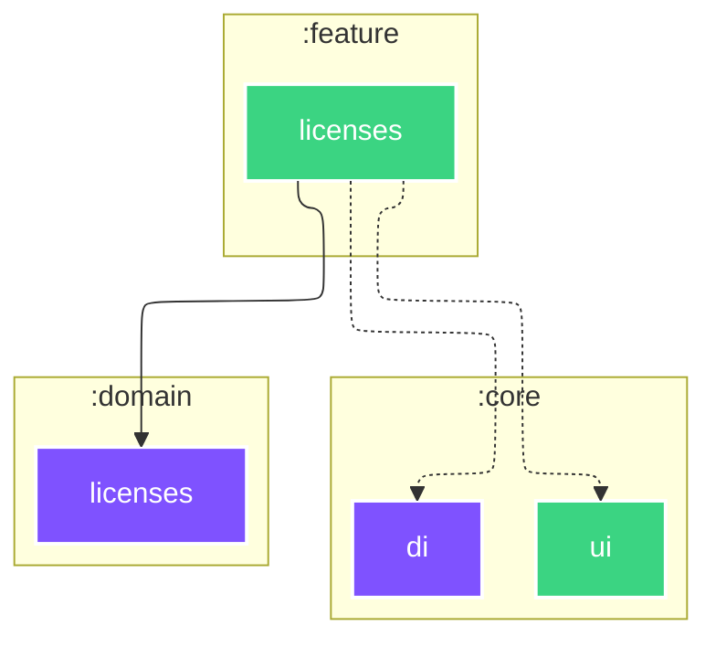

# `:feature:licenses`

<!--region graph-->
> [!TIP]
> [✨ View in `mermaid.live`](https://mermaid.live/view#base64:eyJjb2RlIjoiLS0tXG5jb25maWc6XG4gIGxheW91dDogZWxrXG4gIGVsazpcbiAgICBub2RlUGxhY2VtZW50U3RyYXRlZ3k6IFNJTVBMRVxuLS0tXG5ncmFwaCBUQlxuICBzdWJncmFwaCA6Y29yZVxuICAgIGRpcmVjdGlvbiBUQlxuICAgIDpjb3JlOmRpW2RpXTo6Omp2bVxuICAgIDpjb3JlOnVpW3VpXTo6OmFuZHJvaWQtbGlicmFyeVxuICBlbmRcbiAgc3ViZ3JhcGggOmZlYXR1cmVcbiAgICBkaXJlY3Rpb24gVEJcbiAgICA6ZmVhdHVyZTpsaWNlbnNlc1tsaWNlbnNlc106OjphbmRyb2lkLWxpYnJhcnlcbiAgZW5kXG4gIHN1YmdyYXBoIDpkb21haW5cbiAgICBkaXJlY3Rpb24gVEJcbiAgICA6ZG9tYWluOmxpY2Vuc2VzW2xpY2Vuc2VzXTo6Omp2bVxuICBlbmRcblxuICA6ZmVhdHVyZTpsaWNlbnNlcyAtLi0-IDpjb3JlOmRpXG4gIDpmZWF0dXJlOmxpY2Vuc2VzIC0uLT4gOmNvcmU6dWlcbiAgOmZlYXR1cmU6bGljZW5zZXMgLS0tPiA6ZG9tYWluOmxpY2Vuc2VzXG5cbmNsYXNzRGVmIGFuZHJvaWQtYXBwbGljYXRpb24gZmlsbDojMkM0MTYyLHN0cm9rZTojZmZmLHN0cm9rZS13aWR0aDoycHgsY29sb3I6I2ZmZjtcbmNsYXNzRGVmIGFuZHJvaWQtbGlicmFyeSBmaWxsOiMzQkQ0ODIsc3Ryb2tlOiNmZmYsc3Ryb2tlLXdpZHRoOjJweCxjb2xvcjojZmZmO1xuY2xhc3NEZWYgYW5kcm9pZC10ZXN0IGZpbGw6IzNCRDQ4MixzdHJva2U6I2ZmZixzdHJva2Utd2lkdGg6MnB4LGNvbG9yOiNmZmY7XG5jbGFzc0RlZiBqdm0gZmlsbDojN0Y1MkZGLHN0cm9rZTojZmZmLHN0cm9rZS13aWR0aDoycHgsY29sb3I6I2ZmZjsifQ==)

<!--endregion-->
