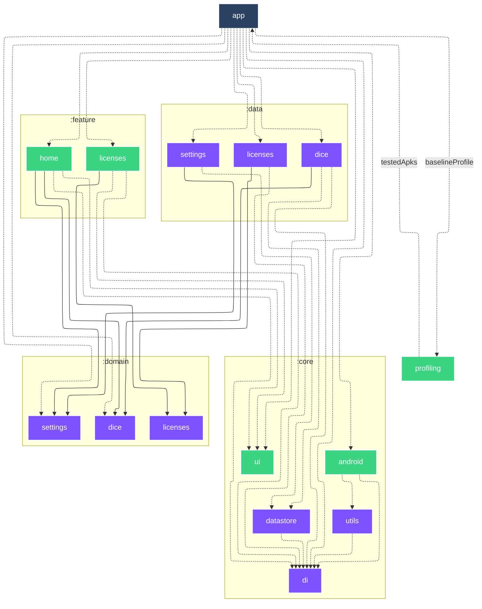

# `:profiling`

<!--region graph-->

> [!TIP]
> [✨ View in `mermaid.live`](https://mermaid.live/view#base64:eyJjb2RlIjoiLS0tXG5jb25maWc6XG4gIGxheW91dDogZWxrXG4gIGVsazpcbiAgICBub2RlUGxhY2VtZW50U3RyYXRlZ3k6IFNJTVBMRVxuLS0tXG5ncmFwaCBUQlxuICBzdWJncmFwaCA6Y29yZVxuICAgIGRpcmVjdGlvbiBUQlxuICAgIDpjb3JlOmFuZHJvaWRbYW5kcm9pZF06OjphbmRyb2lkLWxpYnJhcnlcbiAgICA6Y29yZTpkYXRhc3RvcmVbZGF0YXN0b3JlXTo6Omp2bVxuICAgIDpjb3JlOmRpW2RpXTo6Omp2bVxuICAgIDpjb3JlOnVpW3VpXTo6OmFuZHJvaWQtbGlicmFyeVxuICAgIDpjb3JlOnV0aWxzW3V0aWxzXTo6Omp2bVxuICBlbmRcbiAgc3ViZ3JhcGggOmRvbWFpblxuICAgIGRpcmVjdGlvbiBUQlxuICAgIDpkb21haW46ZGljZVtkaWNlXTo6Omp2bVxuICAgIDpkb21haW46bGljZW5zZXNbbGljZW5zZXNdOjo6anZtXG4gICAgOmRvbWFpbjpzZXR0aW5nc1tzZXR0aW5nc106Ojpqdm1cbiAgZW5kXG4gIHN1YmdyYXBoIDpkYXRhXG4gICAgZGlyZWN0aW9uIFRCXG4gICAgOmRhdGE6ZGljZVtkaWNlXTo6Omp2bVxuICAgIDpkYXRhOmxpY2Vuc2VzW2xpY2Vuc2VzXTo6Omp2bVxuICAgIDpkYXRhOnNldHRpbmdzW3NldHRpbmdzXTo6Omp2bVxuICBlbmRcbiAgc3ViZ3JhcGggOmZlYXR1cmVcbiAgICBkaXJlY3Rpb24gVEJcbiAgICA6ZmVhdHVyZTpob21lW2hvbWVdOjo6YW5kcm9pZC1saWJyYXJ5XG4gICAgOmZlYXR1cmU6bGljZW5zZXNbbGljZW5zZXNdOjo6YW5kcm9pZC1saWJyYXJ5XG4gIGVuZFxuICA6cHJvZmlsaW5nW3Byb2ZpbGluZ106OjphbmRyb2lkLXRlc3RcbiAgOmFwcFthcHBdOjo6YW5kcm9pZC1hcHBsaWNhdGlvblxuXG4gIDphcHAgLS4tPiA6Y29yZTphbmRyb2lkXG4gIDphcHAgLS4tPiA6Y29yZTpkaVxuICA6YXBwIC0uLT4gOmNvcmU6dWlcbiAgOmFwcCAtLi0-IDpkYXRhOmRpY2VcbiAgOmFwcCAtLi0-IDpkYXRhOmxpY2Vuc2VzXG4gIDphcHAgLS4tPiA6ZGF0YTpzZXR0aW5nc1xuICA6YXBwIC0uLT4gOmRvbWFpbjpkaWNlXG4gIDphcHAgLS4tPiA6ZG9tYWluOnNldHRpbmdzXG4gIDphcHAgLS4tPiA6ZmVhdHVyZTpob21lXG4gIDphcHAgLS4tPiA6ZmVhdHVyZTpsaWNlbnNlc1xuICA6YXBwIC0uLT58YmFzZWxpbmVQcm9maWxlfCA6cHJvZmlsaW5nXG4gIDpjb3JlOmFuZHJvaWQgLS4tPiA6Y29yZTpkaVxuICA6Y29yZTphbmRyb2lkIC0uLT4gOmNvcmU6dXRpbHNcbiAgOmNvcmU6ZGF0YXN0b3JlIC0uLT4gOmNvcmU6ZGlcbiAgOmNvcmU6dXRpbHMgLS4tPiA6Y29yZTpkaVxuICA6ZGF0YTpkaWNlIC0uLT4gOmNvcmU6ZGF0YXN0b3JlXG4gIDpkYXRhOmRpY2UgLS4tPiA6Y29yZTpkaVxuICA6ZGF0YTpkaWNlIC0tLT4gOmRvbWFpbjpkaWNlXG4gIDpkYXRhOmxpY2Vuc2VzIC0uLT4gOmNvcmU6ZGlcbiAgOmRhdGE6bGljZW5zZXMgLS0tPiA6ZG9tYWluOmxpY2Vuc2VzXG4gIDpkYXRhOnNldHRpbmdzIC0uLT4gOmNvcmU6ZGF0YXN0b3JlXG4gIDpkYXRhOnNldHRpbmdzIC0tLT4gOmRvbWFpbjpzZXR0aW5nc1xuICA6ZmVhdHVyZTpob21lIC0uLT4gOmNvcmU6ZGlcbiAgOmZlYXR1cmU6aG9tZSAtLi0-IDpjb3JlOnVpXG4gIDpmZWF0dXJlOmhvbWUgLS0tPiA6ZG9tYWluOmRpY2VcbiAgOmZlYXR1cmU6aG9tZSAtLS0-IDpkb21haW46c2V0dGluZ3NcbiAgOmZlYXR1cmU6bGljZW5zZXMgLS4tPiA6Y29yZTpkaVxuICA6ZmVhdHVyZTpsaWNlbnNlcyAtLi0-IDpjb3JlOnVpXG4gIDpmZWF0dXJlOmxpY2Vuc2VzIC0tLT4gOmRvbWFpbjpsaWNlbnNlc1xuICA6cHJvZmlsaW5nIC0uLT58dGVzdGVkQXBrc3wgOmFwcFxuXG5jbGFzc0RlZiBhbmRyb2lkLWFwcGxpY2F0aW9uIGZpbGw6IzJDNDE2MixzdHJva2U6I2ZmZixzdHJva2Utd2lkdGg6MnB4LGNvbG9yOiNmZmY7XG5jbGFzc0RlZiBhbmRyb2lkLWxpYnJhcnkgZmlsbDojM0JENDgyLHN0cm9rZTojZmZmLHN0cm9rZS13aWR0aDoycHgsY29sb3I6I2ZmZjtcbmNsYXNzRGVmIGFuZHJvaWQtdGVzdCBmaWxsOiMzQkQ0ODIsc3Ryb2tlOiNmZmYsc3Ryb2tlLXdpZHRoOjJweCxjb2xvcjojZmZmO1xuY2xhc3NEZWYganZtIGZpbGw6IzdGNTJGRixzdHJva2U6I2ZmZixzdHJva2Utd2lkdGg6MnB4LGNvbG9yOiNmZmY7In0=)
<!--endregion-->
