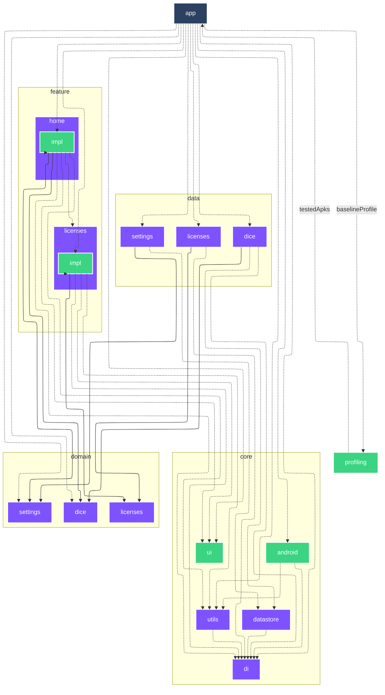

# `:profiling`

<!--region graph-->
> [!TIP]
> [✨ View in `mermaid.live`](https://mermaid.live/view#base64:eyJjb2RlIjoiLS0tXG5jb25maWc6XG4gIGxheW91dDogZWxrXG4gIGVsazpcbiAgICBub2RlUGxhY2VtZW50U3RyYXRlZ3k6IFNJTVBMRVxuLS0tXG5ncmFwaCBUQlxuICBzdWJncmFwaCA6Y29yZSBbY29yZV1cbiAgICBkaXJlY3Rpb24gVEJcbiAgICA6Y29yZTphbmRyb2lkW2FuZHJvaWRdOjo6YW5kcm9pZC1saWJyYXJ5XG4gICAgOmNvcmU6ZGF0YXN0b3JlW2RhdGFzdG9yZV06Ojpqdm1cbiAgICA6Y29yZTpkaVtkaV06Ojpqdm1cbiAgICA6Y29yZTp1aVt1aV06OjphbmRyb2lkLWxpYnJhcnlcbiAgICA6Y29yZTp1dGlsc1t1dGlsc106Ojpqdm1cbiAgZW5kXG4gIHN1YmdyYXBoIDpkb21haW4gW2RvbWFpbl1cbiAgICBkaXJlY3Rpb24gVEJcbiAgICA6ZG9tYWluOmRpY2VbZGljZV06Ojpqdm1cbiAgICA6ZG9tYWluOmxpY2Vuc2VzW2xpY2Vuc2VzXTo6Omp2bVxuICAgIDpkb21haW46c2V0dGluZ3Nbc2V0dGluZ3NdOjo6anZtXG4gIGVuZFxuICBzdWJncmFwaCA6ZGF0YSBbZGF0YV1cbiAgICBkaXJlY3Rpb24gVEJcbiAgICA6ZGF0YTpkaWNlW2RpY2VdOjo6anZtXG4gICAgOmRhdGE6bGljZW5zZXNbbGljZW5zZXNdOjo6anZtXG4gICAgOmRhdGE6c2V0dGluZ3Nbc2V0dGluZ3NdOjo6anZtXG4gIGVuZFxuICBzdWJncmFwaCA6ZmVhdHVyZSBbZmVhdHVyZV1cbiAgICBkaXJlY3Rpb24gVEJcbiAgICA6ZmVhdHVyZTpob21lW2hvbWVdOjo6anZtXG4gICAgOmZlYXR1cmU6bGljZW5zZXNbbGljZW5zZXNdOjo6anZtXG4gIGVuZFxuICBzdWJncmFwaCA6ZmVhdHVyZTpob21lIFtob21lXVxuICAgIGRpcmVjdGlvbiBUQlxuICAgIDpmZWF0dXJlOmhvbWU6aW1wbFtpbXBsXTo6OmFuZHJvaWQtbGlicmFyeVxuICBlbmRcbiAgc3ViZ3JhcGggOmZlYXR1cmU6bGljZW5zZXMgW2xpY2Vuc2VzXVxuICAgIGRpcmVjdGlvbiBUQlxuICAgIDpmZWF0dXJlOmxpY2Vuc2VzOmltcGxbaW1wbF06OjphbmRyb2lkLWxpYnJhcnlcbiAgZW5kXG4gIDpwcm9maWxpbmdbcHJvZmlsaW5nXTo6OmFuZHJvaWQtdGVzdFxuICA6YXBwW2FwcF06OjphbmRyb2lkLWFwcGxpY2F0aW9uXG5cbiAgOmFwcCAtLi0-IDpjb3JlOmFuZHJvaWRcbiAgOmFwcCAtLi0-IDpjb3JlOmRpXG4gIDphcHAgLS4tPiA6Y29yZTp1aVxuICA6YXBwIC0uLT4gOmNvcmU6dXRpbHNcbiAgOmFwcCAtLi0-IDpkYXRhOmRpY2VcbiAgOmFwcCAtLi0-IDpkYXRhOmxpY2Vuc2VzXG4gIDphcHAgLS4tPiA6ZGF0YTpzZXR0aW5nc1xuICA6YXBwIC0uLT4gOmRvbWFpbjpkaWNlXG4gIDphcHAgLS4tPiA6ZG9tYWluOnNldHRpbmdzXG4gIDphcHAgLS4tPiA6ZmVhdHVyZTpob21lOmltcGxcbiAgOmFwcCAtLi0-IDpmZWF0dXJlOmxpY2Vuc2VzOmltcGxcbiAgOmFwcCAtLi0-fGJhc2VsaW5lUHJvZmlsZXwgOnByb2ZpbGluZ1xuICA6Y29yZTphbmRyb2lkIC0uLT4gOmNvcmU6ZGlcbiAgOmNvcmU6YW5kcm9pZCAtLi0-IDpjb3JlOnV0aWxzXG4gIDpjb3JlOmRhdGFzdG9yZSAtLi0-IDpjb3JlOmRpXG4gIDpjb3JlOnV0aWxzIC0uLT4gOmNvcmU6ZGlcbiAgOmRhdGE6ZGljZSAtLi0-IDpjb3JlOmRhdGFzdG9yZVxuICA6ZGF0YTpkaWNlIC0uLT4gOmNvcmU6ZGlcbiAgOmRhdGE6ZGljZSAtLS0-IDpkb21haW46ZGljZVxuICA6ZGF0YTpsaWNlbnNlcyAtLi0-IDpjb3JlOmRpXG4gIDpkYXRhOmxpY2Vuc2VzIC0tLT4gOmRvbWFpbjpsaWNlbnNlc1xuICA6ZGF0YTpzZXR0aW5ncyAtLi0-IDpjb3JlOmRhdGFzdG9yZVxuICA6ZGF0YTpzZXR0aW5ncyAtLS0-IDpkb21haW46c2V0dGluZ3NcbiAgOmZlYXR1cmU6aG9tZTppbXBsIC0uLT4gOmNvcmU6ZGlcbiAgOmZlYXR1cmU6aG9tZTppbXBsIC0uLT4gOmNvcmU6dWlcbiAgOmZlYXR1cmU6aG9tZTppbXBsIC0uLT4gOmNvcmU6dXRpbHNcbiAgOmZlYXR1cmU6aG9tZTppbXBsIC0tLT4gOmRvbWFpbjpkaWNlXG4gIDpmZWF0dXJlOmhvbWU6aW1wbCAtLS0-IDpkb21haW46c2V0dGluZ3NcbiAgOmZlYXR1cmU6aG9tZTppbXBsIC0tLT4gOmZlYXR1cmU6aG9tZVxuICA6ZmVhdHVyZTpob21lOmltcGwgLS4tPiA6ZmVhdHVyZTpsaWNlbnNlc1xuICA6ZmVhdHVyZTpsaWNlbnNlczppbXBsIC0uLT4gOmNvcmU6ZGlcbiAgOmZlYXR1cmU6bGljZW5zZXM6aW1wbCAtLi0-IDpjb3JlOnVpXG4gIDpmZWF0dXJlOmxpY2Vuc2VzOmltcGwgLS4tPiA6Y29yZTp1dGlsc1xuICA6ZmVhdHVyZTpsaWNlbnNlczppbXBsIC0tLT4gOmRvbWFpbjpsaWNlbnNlc1xuICA6ZmVhdHVyZTpsaWNlbnNlczppbXBsIC0tLT4gOmZlYXR1cmU6bGljZW5zZXNcbiAgOnByb2ZpbGluZyAtLi0-fHRlc3RlZEFwa3N8IDphcHBcblxuY2xhc3NEZWYgYW5kcm9pZC1hcHBsaWNhdGlvbiBmaWxsOiMyQzQxNjIsc3Ryb2tlOiNmZmYsc3Ryb2tlLXdpZHRoOjJweCxjb2xvcjojZmZmO1xuY2xhc3NEZWYgYW5kcm9pZC1saWJyYXJ5IGZpbGw6IzNCRDQ4MixzdHJva2U6I2ZmZixzdHJva2Utd2lkdGg6MnB4LGNvbG9yOiNmZmY7XG5jbGFzc0RlZiBhbmRyb2lkLXRlc3QgZmlsbDojM0JENDgyLHN0cm9rZTojZmZmLHN0cm9rZS13aWR0aDoycHgsY29sb3I6I2ZmZjtcbmNsYXNzRGVmIGp2bSBmaWxsOiM3RjUyRkYsc3Ryb2tlOiNmZmYsc3Ryb2tlLXdpZHRoOjJweCxjb2xvcjojZmZmOyJ9)

<!--endregion-->
