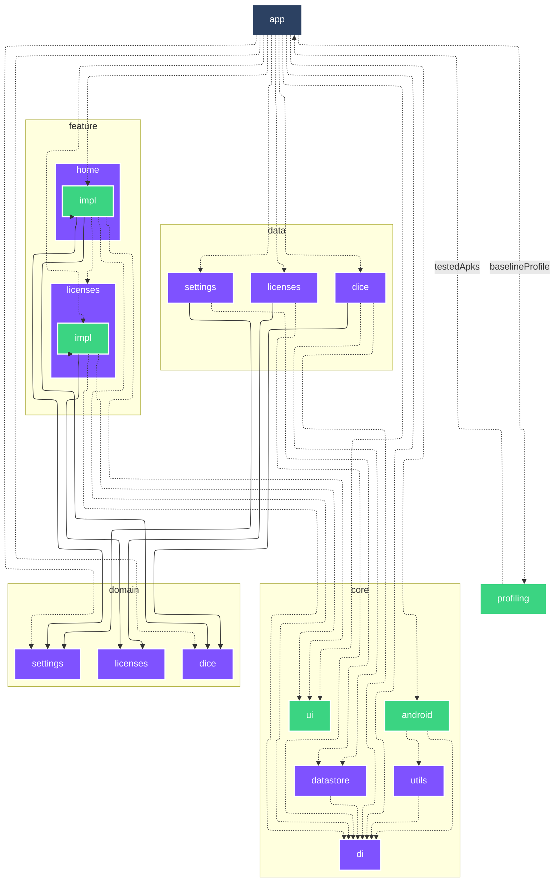

# `:profiling`

<!--region graph-->
> [!TIP]
> [✨ View in `mermaid.live`](https://mermaid.live/view#base64:eyJjb2RlIjoiLS0tXG5jb25maWc6XG4gIGxheW91dDogZWxrXG4gIGVsazpcbiAgICBub2RlUGxhY2VtZW50U3RyYXRlZ3k6IFNJTVBMRVxuLS0tXG5ncmFwaCBUQlxuICBzdWJncmFwaCA6Y29yZSBbY29yZV1cbiAgICBkaXJlY3Rpb24gVEJcbiAgICA6Y29yZTphbmRyb2lkW2FuZHJvaWRdOjo6YW5kcm9pZC1saWJyYXJ5XG4gICAgOmNvcmU6ZGF0YXN0b3JlW2RhdGFzdG9yZV06Ojpqdm1cbiAgICA6Y29yZTpkaVtkaV06Ojpqdm1cbiAgICA6Y29yZTp1aVt1aV06OjphbmRyb2lkLWxpYnJhcnlcbiAgICA6Y29yZTp1dGlsc1t1dGlsc106Ojpqdm1cbiAgZW5kXG4gIHN1YmdyYXBoIDpkb21haW4gW2RvbWFpbl1cbiAgICBkaXJlY3Rpb24gVEJcbiAgICA6ZG9tYWluOmRpY2VbZGljZV06Ojpqdm1cbiAgICA6ZG9tYWluOmxpY2Vuc2VzW2xpY2Vuc2VzXTo6Omp2bVxuICAgIDpkb21haW46c2V0dGluZ3Nbc2V0dGluZ3NdOjo6anZtXG4gIGVuZFxuICBzdWJncmFwaCA6ZGF0YSBbZGF0YV1cbiAgICBkaXJlY3Rpb24gVEJcbiAgICA6ZGF0YTpkaWNlW2RpY2VdOjo6anZtXG4gICAgOmRhdGE6bGljZW5zZXNbbGljZW5zZXNdOjo6anZtXG4gICAgOmRhdGE6c2V0dGluZ3Nbc2V0dGluZ3NdOjo6anZtXG4gIGVuZFxuICBzdWJncmFwaCA6ZmVhdHVyZSBbZmVhdHVyZV1cbiAgICBkaXJlY3Rpb24gVEJcbiAgICA6ZmVhdHVyZTpob21lW2hvbWVdOjo6anZtXG4gICAgOmZlYXR1cmU6bGljZW5zZXNbbGljZW5zZXNdOjo6anZtXG4gIGVuZFxuICBzdWJncmFwaCA6ZmVhdHVyZTpob21lIFtob21lXVxuICAgIGRpcmVjdGlvbiBUQlxuICAgIDpmZWF0dXJlOmhvbWU6aW1wbFtpbXBsXTo6OmFuZHJvaWQtbGlicmFyeVxuICBlbmRcbiAgc3ViZ3JhcGggOmZlYXR1cmU6bGljZW5zZXMgW2xpY2Vuc2VzXVxuICAgIGRpcmVjdGlvbiBUQlxuICAgIDpmZWF0dXJlOmxpY2Vuc2VzOmltcGxbaW1wbF06OjphbmRyb2lkLWxpYnJhcnlcbiAgZW5kXG4gIDpwcm9maWxpbmdbcHJvZmlsaW5nXTo6OmFuZHJvaWQtdGVzdFxuICA6YXBwW2FwcF06OjphbmRyb2lkLWFwcGxpY2F0aW9uXG5cbiAgOmFwcCAtLi0-IDpjb3JlOmFuZHJvaWRcbiAgOmFwcCAtLi0-IDpjb3JlOmRpXG4gIDphcHAgLS4tPiA6Y29yZTp1aVxuICA6YXBwIC0uLT4gOmRhdGE6ZGljZVxuICA6YXBwIC0uLT4gOmRhdGE6bGljZW5zZXNcbiAgOmFwcCAtLi0-IDpkYXRhOnNldHRpbmdzXG4gIDphcHAgLS4tPiA6ZG9tYWluOmRpY2VcbiAgOmFwcCAtLi0-IDpkb21haW46c2V0dGluZ3NcbiAgOmFwcCAtLi0-IDpmZWF0dXJlOmhvbWU6aW1wbFxuICA6YXBwIC0uLT4gOmZlYXR1cmU6bGljZW5zZXM6aW1wbFxuICA6YXBwIC0uLT58YmFzZWxpbmVQcm9maWxlfCA6cHJvZmlsaW5nXG4gIDpjb3JlOmFuZHJvaWQgLS4tPiA6Y29yZTpkaVxuICA6Y29yZTphbmRyb2lkIC0uLT4gOmNvcmU6dXRpbHNcbiAgOmNvcmU6ZGF0YXN0b3JlIC0uLT4gOmNvcmU6ZGlcbiAgOmNvcmU6dXRpbHMgLS4tPiA6Y29yZTpkaVxuICA6ZGF0YTpkaWNlIC0uLT4gOmNvcmU6ZGF0YXN0b3JlXG4gIDpkYXRhOmRpY2UgLS4tPiA6Y29yZTpkaVxuICA6ZGF0YTpkaWNlIC0tLT4gOmRvbWFpbjpkaWNlXG4gIDpkYXRhOmxpY2Vuc2VzIC0uLT4gOmNvcmU6ZGlcbiAgOmRhdGE6bGljZW5zZXMgLS0tPiA6ZG9tYWluOmxpY2Vuc2VzXG4gIDpkYXRhOnNldHRpbmdzIC0uLT4gOmNvcmU6ZGF0YXN0b3JlXG4gIDpkYXRhOnNldHRpbmdzIC0tLT4gOmRvbWFpbjpzZXR0aW5nc1xuICA6ZmVhdHVyZTpob21lOmltcGwgLS4tPiA6Y29yZTpkaVxuICA6ZmVhdHVyZTpob21lOmltcGwgLS4tPiA6Y29yZTp1aVxuICA6ZmVhdHVyZTpob21lOmltcGwgLS0tPiA6ZG9tYWluOmRpY2VcbiAgOmZlYXR1cmU6aG9tZTppbXBsIC0tLT4gOmRvbWFpbjpzZXR0aW5nc1xuICA6ZmVhdHVyZTpob21lOmltcGwgLS0tPiA6ZmVhdHVyZTpob21lXG4gIDpmZWF0dXJlOmhvbWU6aW1wbCAtLi0-IDpmZWF0dXJlOmxpY2Vuc2VzXG4gIDpmZWF0dXJlOmxpY2Vuc2VzOmltcGwgLS4tPiA6Y29yZTpkaVxuICA6ZmVhdHVyZTpsaWNlbnNlczppbXBsIC0uLT4gOmNvcmU6dWlcbiAgOmZlYXR1cmU6bGljZW5zZXM6aW1wbCAtLS0-IDpkb21haW46bGljZW5zZXNcbiAgOmZlYXR1cmU6bGljZW5zZXM6aW1wbCAtLS0-IDpmZWF0dXJlOmxpY2Vuc2VzXG4gIDpwcm9maWxpbmcgLS4tPnx0ZXN0ZWRBcGtzfCA6YXBwXG5cbmNsYXNzRGVmIGFuZHJvaWQtYXBwbGljYXRpb24gZmlsbDojMkM0MTYyLHN0cm9rZTojZmZmLHN0cm9rZS13aWR0aDoycHgsY29sb3I6I2ZmZjtcbmNsYXNzRGVmIGFuZHJvaWQtbGlicmFyeSBmaWxsOiMzQkQ0ODIsc3Ryb2tlOiNmZmYsc3Ryb2tlLXdpZHRoOjJweCxjb2xvcjojZmZmO1xuY2xhc3NEZWYgYW5kcm9pZC10ZXN0IGZpbGw6IzNCRDQ4MixzdHJva2U6I2ZmZixzdHJva2Utd2lkdGg6MnB4LGNvbG9yOiNmZmY7XG5jbGFzc0RlZiBqdm0gZmlsbDojN0Y1MkZGLHN0cm9rZTojZmZmLHN0cm9rZS13aWR0aDoycHgsY29sb3I6I2ZmZjsifQ==)

```mermaid
---
config:
  layout: elk
  elk:
    nodePlacementStrategy: SIMPLE
---
graph TB
  subgraph :core [core]
    direction TB
    :core:android[android]:::android-library
    :core:datastore[datastore]:::jvm
    :core:di[di]:::jvm
    :core:ui[ui]:::android-library
    :core:utils[utils]:::jvm
  end
  subgraph :domain [domain]
    direction TB
    :domain:dice[dice]:::jvm
    :domain:licenses[licenses]:::jvm
    :domain:settings[settings]:::jvm
  end
  subgraph :data [data]
    direction TB
    :data:dice[dice]:::jvm
    :data:licenses[licenses]:::jvm
    :data:settings[settings]:::jvm
  end
  subgraph :feature [feature]
    direction TB
    :feature:home[home]:::jvm
    :feature:licenses[licenses]:::jvm
  end
  subgraph :feature:home [home]
    direction TB
    :feature:home:impl[impl]:::android-library
  end
  subgraph :feature:licenses [licenses]
    direction TB
    :feature:licenses:impl[impl]:::android-library
  end
  :profiling[profiling]:::android-test
  :app[app]:::android-application

  :app -.-> :core:android
  :app -.-> :core:di
  :app -.-> :core:ui
  :app -.-> :data:dice
  :app -.-> :data:licenses
  :app -.-> :data:settings
  :app -.-> :domain:dice
  :app -.-> :domain:settings
  :app -.-> :feature:home:impl
  :app -.-> :feature:licenses:impl
  :app -.->|baselineProfile| :profiling
  :core:android -.-> :core:di
  :core:android -.-> :core:utils
  :core:datastore -.-> :core:di
  :core:utils -.-> :core:di
  :data:dice -.-> :core:datastore
  :data:dice -.-> :core:di
  :data:dice ---> :domain:dice
  :data:licenses -.-> :core:di
  :data:licenses ---> :domain:licenses
  :data:settings -.-> :core:datastore
  :data:settings ---> :domain:settings
  :feature:home:impl -.-> :core:di
  :feature:home:impl -.-> :core:ui
  :feature:home:impl ---> :domain:dice
  :feature:home:impl ---> :domain:settings
  :feature:home:impl ---> :feature:home
  :feature:home:impl -.-> :feature:licenses
  :feature:licenses:impl -.-> :core:di
  :feature:licenses:impl -.-> :core:ui
  :feature:licenses:impl ---> :domain:licenses
  :feature:licenses:impl ---> :feature:licenses
  :profiling -.->|testedApks| :app

classDef android-application fill:#2C4162,stroke:#fff,stroke-width:2px,color:#fff;
classDef android-library fill:#3BD482,stroke:#fff,stroke-width:2px,color:#fff;
classDef android-test fill:#3BD482,stroke:#fff,stroke-width:2px,color:#fff;
classDef jvm fill:#7F52FF,stroke:#fff,stroke-width:2px,color:#fff;
```
<!--endregion-->
